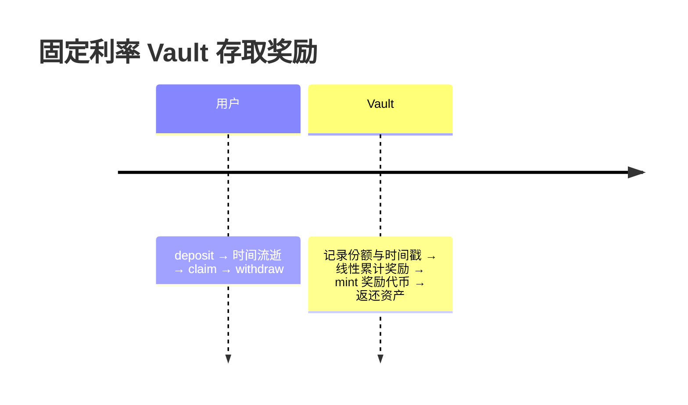
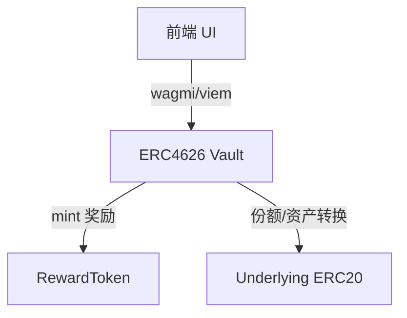
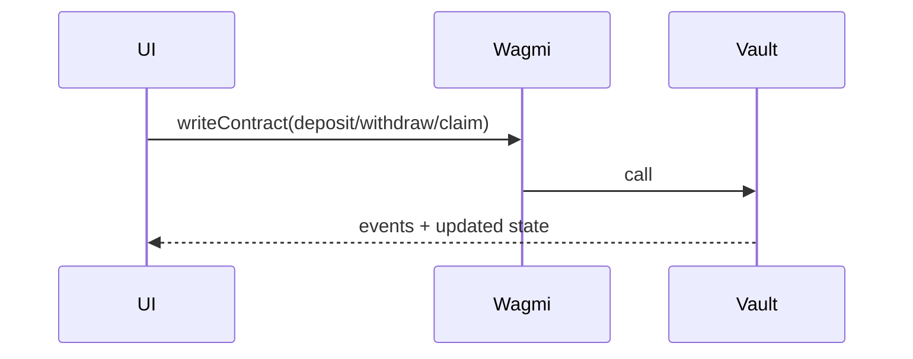

# 固定年化金库 + 奖励代币（ERC4626 + ETH 教学版）

面向 Solidity/Web3 初级开发者教学，包含：合约实现、Hardhat 部署与测试、Next.js 14 前端、命令行任务、课程文档与可视化、CI。

- [固定年化金库 + 奖励代币（ERC4626 + ETH 教学版）](#固定年化金库--奖励代币erc4626--eth-教学版)
  - [课程大纲](#课程大纲)
  - [技术栈](#技术栈)
  - [仓库结构](#仓库结构)
  - [环境要求](#环境要求)
  - [快速开始（Hardhat）](#快速开始hardhat)
  - [🚀 推荐：Hardhat Ignition 部署](#-推荐hardhat-ignition-部署)
    - [基础部署命令](#基础部署命令)
    - [带合约验证的部署](#带合约验证的部署)
    - [参数化部署](#参数化部署)
    - [部署状态管理](#部署状态管理)
  - [传统脚本部署（仍支持）](#传统脚本部署仍支持)
  - [部署输出](#部署输出)
  - [合约验证](#合约验证)
    - [自动验证（推荐）](#自动验证推荐)
    - [手动验证](#手动验证)
  - [✨ Ignition 相比传统脚本的优势](#-ignition-相比传统脚本的优势)
  - [📋 快速命令参考](#-快速命令参考)
    - [常用 npm 脚本](#常用-npm-脚本)
    - [环境变量快速配置](#环境变量快速配置)
  - [前端（Next.js 14）](#前端nextjs-14)
  - [核心流程图](#核心流程图)
  - [课程文档](#课程文档)
  - [CI](#ci)
  - [常见问题](#常见问题)
  - [免责声明](#免责声明)
  - [License](#license)

---

## 课程大纲
- 概念与目标：固定年化、收益来源、教学简化假设（仅教学用途）
- 标准与基础：ERC20 / ERC4626、份额-资产换算、CEI、重入保护（见 `docs/lessons/02-solidity-basics.md`）
- 利率与计息：bps 基点、线性计息、年化到实时换算
- 合约实现（见 `docs/lessons/03-vault-contract.md`）：
  - `RewardToken` 奖励代币（Minter 权限）
  - `FixedRateETHVault` ETH 教学金库（安全转账、线性计息、Claim）
  - `FixedRateERC4626Vault` 标准化金库（`deposit/mint/withdraw/redeem` 钩子记息与奖励）
- 工程与测试（见 `docs/lessons/04-hardhat-deploy.md`）：Hardhat 配置、部署脚本、Tasks 命令、时间快进单测
- 前端集成（见 `docs/lessons/05-frontend.md`）：Next.js 14 + wagmi/viem + RainbowKit 的交互面板
- 可视化与数据流：Mermaid 架构/时序图（见 `docs/lessons/01-intro.md`、`docs/lessons/06-notional-deep-dive.md`）
- 演示环节（结合 `docs/lessons`）：
  1. 本地环境：`npm install` → `npx hardhat compile` → `npx hardhat test`
  2. 部署演示：本地链或 Sepolia（参考 `scripts/deploy.ts` 与 `docs/lessons/04-hardhat-deploy.md`）
  3. CLI 交互：`tasks` 目录的 deposit/withdraw/claim（演示奖励线性累积与领取）
  4. 前端演示：`frontend/.env.local` 配置地址 → `npm run dev` → Deposit/Withdraw/Claim 流程（参考 `docs/lessons/05-frontend.md`）
- 案例对比：教学版 Vault vs Notional（fCash、AMM、清算机制，对比见 `docs/lessons/06-notional-deep-dive.md`）
- 作业与扩展（`docs/lessons/07-assignments.md`）：事件与 `Pausable`、更多边界测试、UI/UX 优化

---

## 技术栈
- 合约/脚本：Hardhat + ethers v6 + OpenZeppelin 5.x（`ERC4626`, `ERC20`, `Ownable`, `ReentrancyGuard`）
- 部署工具：Hardhat Ignition（声明式部署和验证）
- 前端：Next.js 14（App Router）+ TypeScript + wagmi + viem + RainbowKit + TailwindCSS
- 测试网：Sepolia（可选）

---

## 仓库结构
```text
contracts/
  RewardToken.sol                # ERC20 奖励代币（可配置 Minter）
  FixedRateETHVault.sol         # 教学版 ETH 金库
  FixedRateERC4626Vault.sol     # 基于 ERC4626 的固定利率金库
  MockERC20.sol                 # 测试用 ERC20
scripts/
  deploy.ts                     # 部署奖励代币、ETH Vault、ERC4626 Vault
  interact.ts                   # 演示 4626 deposit → claim → withdraw
tasks/
  deposit.ts  withdraw.ts  claim.ts
 test/
  vault.spec.ts                 # 时间快进验证计息与奖励发放
 docs/lessons/
  01-intro.md ... 08-faq.md     # 教学文档与图表
frontend/
  app/, hooks/, tailwind 等前端代码
.github/workflows/ci.yml        # CI：编译、测试、前端 build
```

---

## 环境要求
- Node.js 18 或 20（推荐 LTS）。Hardhat 暂不支持 Node 23，请勿使用过新的版本
- npm 9+ / 10+
- Git

可使用 nvm 管理 Node 版本：
```bash
# macOS/Linux 参考
curl -o- https://raw.githubusercontent.com/nvm-sh/nvm/v0.39.7/install.sh | bash
nvm install 20
nvm use 20
node -v
```

---

## 快速开始（Hardhat）
1) 安装依赖并编译/测试
```bash
npm install
npx hardhat compile
npx hardhat test
```

2) 配置环境变量（可选：部署到 Sepolia）
```bash
# 创建 .env 文件并填入以下配置：
# RPC 配置
SEPOLIA_RPC_URL="https://sepolia.infura.io/v3/YOUR_PROJECT_ID"

# 部署账户私钥
PRIVATE_KEY=0xYOUR_PRIVATE_KEY

# 合约验证（可选）
ETHERSCAN_API_KEY=your_etherscan_api_key

# 可选：使用现有的底层代币地址（否则会部署新的 MockERC20）
# ERC20_UNDERLYING_ADDRESS=0x...
```

PRIVATE_KEY 配置说明：
- 来源：测试用钱包（如 MetaMask）导出的私钥，或使用 Hardhat/Foundry 生成的新助记词账户的私钥。
- 格式：必须为 0x 开头、64 位十六进制字符串；不要加引号，不要包含空格。例如：
  ```bash
  PRIVATE_KEY=0xaaaaaaaaaaaaaaaaaaaaaaaaaaaaaaaaaaaaaaaaaaaaaaaaaaaaaaaaaaaaaaaa
  ```
- 用途：仅在部署到 Sepolia 测试网时需要；本地 `hardhat` 网络不需要。
- 资金：给该地址充值 Sepolia ETH（例如使用 [Alchemy Sepolia Faucet](`https://www.alchemy.com/faucets/ethereum-sepolia`)）。
- 安全：请勿将私钥用于真实资产账户；建议使用全新测试钱包。务必不要提交 `.env` 到仓库（通常已在 `.gitignore` 中忽略）。
- 也可通过临时环境变量方式执行（不落盘）：
  ```bash
  SEPOLIA_RPC_URL="https://sepolia.infura.io/v3/YOUR_KEY" \
  PRIVATE_KEY=0xYOUR_PRIVATE_KEY \
  npx hardhat run scripts/deploy.ts --network sepolia
  ```

3) 部署与验证

## 🚀 推荐：Hardhat Ignition 部署

### 基础部署命令

```bash
# 本地 Hardhat 网络部署（测试用）
npm run deploy:script
npm run deploy:ignition

# Sepolia 测试网部署
npm run deploy:script:sepolia
npm run deploy:ignition:sepolia

# 其他网络部署
npx hardhat ignition deploy ignition/modules/FixedYieldVaults.ts --network <network-name>
```

### 带合约验证的部署

```bash
# 方式一：直接部署并验证（推荐）
npm run deploy:ignition:verify

# 方式二：先部署后验证
npm run deploy:ignition:sepolia
npm run verify

# 方式三：完整命令
npx hardhat ignition deploy ignition/modules/FixedYieldVaults.ts --network sepolia --verify
```

### 参数化部署

创建参数文件 `ignition-parameters.json`：
```json
{
  "FixedYieldVaultsModule": {
    "rewardName": "Custom Reward Token",
    "rewardSymbol": "CRT",
    "annualRateBps": 750,
    "mockTokenName": "Test USDC",
    "mockTokenSymbol": "tUSDC"
  }
}
```

使用参数文件部署：
```bash
npx hardhat ignition deploy ignition/modules/FixedYieldVaults.ts \
  --network sepolia \
  --parameters ignition-parameters.json \
  --verify
```

### 部署状态管理

```bash
# 查看部署状态
npm run status

# 重新部署（如果中断）
npm run deploy:ignition:sepolia  # 会自动从中断点继续

# 强制重新部署
rm -rf ignition/deployments/sepolia
npm run deploy:ignition:sepolia
```

## 传统脚本部署（仍支持）

```bash
npm run deploy  # Sepolia 测试网
npx hardhat run scripts/deploy.ts --network sepolia
```

## 部署输出

成功部署后会获得：

1. **控制台输出**: 包含所有合约地址
2. **地址文件**: `deployments/<network>-addresses.json`
3. **前端环境变量**: 直接可用的 `.env.local` 配置

示例输出：
```
📋 Contract Addresses:
{
  "network": "sepolia",
  "chainId": 11155111,
  "rewardToken": "0x...",
  "ethVault": "0x...",
  "erc4626Vault": "0x...",
  "underlying": "0x..."
}

🌐 Environment variables for frontend (.env.local):
NEXT_PUBLIC_REWARD_TOKEN_ADDRESS=0x...
NEXT_PUBLIC_VAULT_ADDRESS=0x...
NEXT_PUBLIC_ETH_VAULT_ADDRESS=0x...
NEXT_PUBLIC_UNDERLYING_ADDRESS=0x...
NEXT_PUBLIC_CHAIN_ID=11155111
```

## 合约验证

### 自动验证（推荐）
在 `.env` 中配置：
```bash
ETHERSCAN_API_KEY=your_etherscan_api_key_here
```

然后部署时添加 `--verify` 标志：
```bash
npm run deploy:ignition:verify
```

### 手动验证
```bash
# 验证单个合约
npx hardhat verify --network sepolia <合约地址> <构造函数参数>

# 验证整个 Ignition 模块
npm run verify
```

## ✨ Ignition 相比传统脚本的优势

| 特性 | 传统脚本 | Ignition |
|------|----------|----------|
| 依赖管理 | ❌ 手动编写 | ✅ 自动处理 |
| 错误恢复 | ❌ 需要重新运行 | ✅ 从中断点继续 |
| 状态跟踪 | ❌ 无持久化 | ✅ 完整状态管理 |
| 参数管理 | ❌ 硬编码 | ✅ 灵活参数化 |
| 合约验证 | ❌ 需要额外脚本 | ✅ 内置支持 |
| 部署日志 | ❌ 基础输出 | ✅ 结构化日志 |
| 地址管理 | ❌ 手动处理 | ✅ 自动保存 |

详细文档: `ignition/README.md`

## 📋 快速命令参考

### 常用 npm 脚本

```bash
# 编译和测试
npm run compile              # 编译所有合约
npm run test                 # 运行测试

# Ignition 部署（推荐）
npm run deploy:ignition:verify    # Sepolia 部署 + 验证
npm run deploy:ignition:sepolia   # Sepolia 部署（不验证）
npm run deploy:script:sepolia     # Sepolia 自定义脚本部署

# 部署管理
npm run status               # 查看部署状态
npm run verify               # 验证已部署的合约

# 传统部署
npm run deploy               # 传统脚本部署到 Sepolia
```

### 环境变量快速配置

```bash
# 创建 .env 文件
cat > .env << EOF
SEPOLIA_RPC_URL="https://sepolia.infura.io/v3/YOUR_PROJECT_ID"
PRIVATE_KEY=0xYOUR_PRIVATE_KEY
ETHERSCAN_API_KEY=your_etherscan_api_key
EOF
```

4) 交互演示脚本（本地/测试网）
```bash
# 需要在环境变量中提供部署地址：
# REWARD_TOKEN_ADDRESS, ERC4626_VAULT_ADDRESS, ERC20_UNDERLYING_ADDRESS
npx hardhat run scripts/interact.ts --network hardhat
```

5) 命令行任务（Tasks）
```bash
# 向 ETH 教学 Vault 存入 1 ETH
npx hardhat deposit:eth --vault 0xETH_VAULT --amount 1 --network hardhat

# 向 ERC4626 Vault 存入 100 单位（默认 18 decimals）
npx hardhat deposit:erc4626 --vault 0xVAULT --underlying 0xUNDERLYING --amount 100 --network hardhat

# 提取/领取
npx hardhat withdraw:eth --vault 0xETH_VAULT --amount 0.5 --network hardhat
npx hardhat withdraw:erc4626 --vault 0xVAULT --amount 10 --network hardhat
npx hardhat claim:eth --vault 0xETH_VAULT --network hardhat
npx hardhat claim:erc4626 --vault 0xVAULT --network hardhat
```

---

## 前端（Next.js 14）
1) 环境变量
请在 `frontend/` 下新建 `.env.local`：
```bash
# 必需的合约地址（部署后填入真实地址）
NEXT_PUBLIC_VAULT_ADDRESS=0xERC4626_VAULT_ADDRESS_HERE
NEXT_PUBLIC_ETH_VAULT_ADDRESS=0xETH_VAULT_ADDRESS_HERE
NEXT_PUBLIC_REWARD_TOKEN_ADDRESS=0xREWARD_TOKEN_ADDRESS_HERE
NEXT_PUBLIC_UNDERLYING_ADDRESS=0xUNDERLYING_TOKEN_ADDRESS_HERE

# 可选配置
NEXT_PUBLIC_CHAIN_ID=11155111
```

2) 安装与启动
```bash
cd frontend
npm install  # 现已包含 @tanstack/react-query 依赖
npm run dev
# http://localhost:3000
```

**注意**：前端代码已优化，包含：
- ✅ 修复了缺失的 `@tanstack/react-query` 依赖
- ✅ 改进了错误处理和用户体验
- ✅ 支持自定义存取金额（不再硬编码）
- ✅ 添加了加载状态和错误提示
- ✅ 合约地址可点击跳转到 Sepolia Etherscan
- ✅ 显示已领取的 Reward Token 余额
- ✅ 实时显示钱包中的代币余额
页面 `Vault 面板` 支持：
- ERC4626 固定利率金库操作界面
- 显示合约信息（Vault、Underlying Token、Reward Token）
- 实时余额展示：年化利率、持有份额、对应资产、待领奖励
- 钱包余额：Underlying Token 和已领取 Reward Token
- 三大核心操作：Deposit（存款）/ Withdraw（提款）/ Claim（领取奖励）
- 交易状态实时跟踪和用户友好的加载提示

---

## 核心流程图
固定利率 Vault 存取与奖励：


ERC4626 数据流：


前端交互序列：


更多图示参见 `docs/lessons/`。

---

## 课程文档
- `docs/lessons/01-intro.md`：项目简介与总览
- `02-solidity-basics.md`：Solidity 与标准回顾
- `03-vault-contract.md`：金库实现要点与时序
- `04-hardhat-deploy.md`：部署与脚本
- `05-frontend.md`：前端集成
- `06-notional-deep-dive.md`：教学版 Vault vs Notional（表格与流程图）
- `07-assignments.md`：练习与扩展
- `08-faq.md`：常见问题

---

## CI
本仓库包含 GitHub Actions 工作流 `.github/workflows/ci.yml`：
- 安装依赖
- Hardhat 编译与测试
- 前端安装与构建

---

## 常见问题
- Node 版本过新/过旧会导致 Hardhat 警告或报错，推荐 Node 18/20 LTS
- 连接 npm 失败时，请检查网络或重试；必要时配置代理或换源
- 奖励单位与底层资产单位在教学版中按 1:1 简化，生产环境应独立配置

---

## 免责声明
本项目仅用于教学演示，不构成任何投资建议。代码未经审计，请勿在生产或主网环境直接使用。

## License
MIT © defi-fixed-yield-course contributors