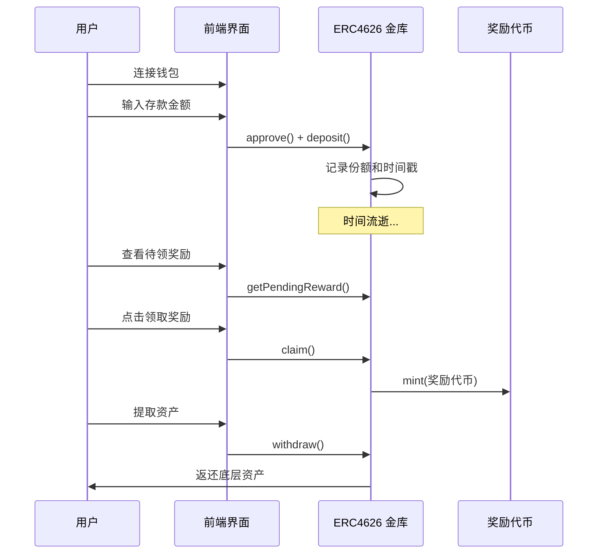

# DeFi 固定利率金库教学项目

面向 Solidity/Web3 初级开发者的教学项目，展示如何构建一个基于 ERC4626 标准的固定利率金库，包含完整的智能合约实现、现代化部署流程和前端界面。

## 📖 教学文档

详细的教学文档位于 `docs/lessons/` 目录，建议按顺序学习：

1. **[项目介绍](docs/lessons/01-intro.md)** - 固定利率 DeFi 的基本概念
2. **[DApp vs 传统应用](docs/lessons/01.5-dapp-vs-traditional.md)** - 架构与技术对比
3. **[Solidity 基础](docs/lessons/02-solidity-basics.md)** - 智能合约核心特性
4. **[金库合约](docs/lessons/03-vault-contract.md)** - ERC4626 实现详解
5. **[部署流程](docs/lessons/04-hardhat-deploy.md)** - Hardhat Ignition 完整指南
6. **[前端集成](docs/lessons/05-frontend.md)** - Next.js + wagmi 完整实现
7. **[真实协议对比](docs/lessons/06-notional-deep-dive.md)** - 与 Notional Finance 对比分析

## 🛠️ 技术栈

**智能合约**
- Hardhat + TypeScript
- OpenZeppelin 5.x (ERC4626, ERC20, Ownable, ReentrancyGuard)  
- Hardhat Ignition (声明式部署)

**前端**
- Next.js 14 (App Router) + TypeScript
- wagmi + viem + RainbowKit (Web3 集成)
- TailwindCSS (样式)

**区块链网络**
- 以太坊 Sepolia 测试网 (部署演示)

## 🚀 快速开始

### 1. 环境准备
```bash
# 安装依赖
npm install

# 编译合约
npx hardhat compile

# 运行测试
npx hardhat test
```

### 2. 环境变量配置 (部署到 Sepolia)
```bash
# 创建 .env 文件
cat > .env << EOF
SEPOLIA_RPC_URL="https://sepolia.infura.io/v3/YOUR_PROJECT_ID"
PRIVATE_KEY=0xYOUR_PRIVATE_KEY
ETHERSCAN_API_KEY=your_etherscan_api_key
EOF
```

### 3. 部署合约

**推荐：Hardhat Ignition 部署**
```bash
# 部署到 Sepolia
npm run deploy:ignition:sepolia

# 验证
npx hardhat ignition verify chain-11155111 --include-unrelated-contracts
```

### 4. 启动前端

```bash
cd frontend

# 配置合约地址 (.env.local)
NEXT_PUBLIC_VAULT_ADDRESS=0x...
NEXT_PUBLIC_UNDERLYING_ADDRESS=0x...
NEXT_PUBLIC_REWARD_TOKEN_ADDRESS=0x...

# 启动开发服务器
npm install
npm run dev
# 访问 http://localhost:3000
```

## 🎯 核心功能展示

- 🔗 **钱包连接** - RainbowKit 一键连接多种钱包
- 💰 **存款操作** - 自动授权 + 存款，实时状态反馈
- 💸 **提款操作** - 从金库提取底层资产
- 🎁 **奖励领取** - 领取累积的固定利率奖励
- 📊 **实时数据** - 年化利率、持仓份额、待领奖励等
- 🔗 **Etherscan 集成** - 合约地址直接跳转区块浏览器

## 🔄 核心流程

### 用户交互流程


## 💻 开发环境

**Node.js 版本要求**
- Node.js 18 或 20 (推荐 LTS)
- 暂不支持 Node.js 23

**推荐使用 nvm 管理版本**
```bash
# macOS/Linux
curl -o- https://raw.githubusercontent.com/nvm-sh/nvm/v0.39.7/install.sh | bash
nvm install 20 && nvm use 20
```

## ⚠️ 重要说明

### 教学用途
- ✅ 学习 DeFi 基础概念和 ERC4626 标准
- ✅ 理解智能合约开发流程
- ✅ 体验完整的 DApp 开发
- ❌ **请勿直接用于生产环境或真实资金**

### 安全提醒
- 代码未经专业审计
- 仅在测试网络使用
- 不构成任何投资建议
- 私钥安全：仅使用测试账户

## 📄 License

MIT © DeFi Fixed Yield Course Contributors

---

**开始你的 DeFi 开发之旅！** 🚀

如有问题，请查看 [常见问题](docs/lessons/08-faq.md) 或提交 Issue。