# DeFi 固定利率金库教学项目

面向 Solidity/Web3 初级开发者的教学项目，展示如何构建一个基于 ERC4626 标准的固定利率金库，包含完整的智能合约实现、现代化部署流程和前端界面。

## 📚 课程大纲

- **智能合约基础** - ERC20/ERC4626 标准、Solidity 语言特性、安全模式
- **DApp vs 传统应用** - 架构对比、技术栈差异、用户体验分析  
- **金库合约实现** - 固定利率计算、线性奖励机制、ERC4626 集成
- **现代化部署** - Hardhat Ignition 声明式部署、合约验证、参数化配置
- **前端集成** - Next.js 14 + wagmi/viem + RainbowKit 完整 DApp 界面
- **实际案例对比** - 教学版 vs Notional Finance 等生产级协议

## 📖 教学文档

详细的教学文档位于 `docs/lessons/` 目录，建议按顺序学习：

1. **[项目介绍](docs/lessons/01-intro.md)** - 固定利率 DeFi 的基本概念
2. **[DApp vs 传统应用](docs/lessons/01.5-dapp-vs-traditional.md)** - 架构与技术对比
3. **[Solidity 基础](docs/lessons/02-solidity-basics.md)** - 智能合约核心特性
4. **[金库合约](docs/lessons/03-vault-contract.md)** - ERC4626 实现详解
5. **[部署流程](docs/lessons/04-hardhat-deploy.md)** - Hardhat Ignition 完整指南
6. **[前端集成](docs/lessons/05-frontend.md)** - Next.js + wagmi 完整实现
7. **[真实协议对比](docs/lessons/06-notional-deep-dive.md)** - 与 Notional Finance 对比分析

## 🛠️ 技术栈

**智能合约**
- Hardhat + TypeScript
- OpenZeppelin 5.x (ERC4626, ERC20, Ownable, ReentrancyGuard)  
- Hardhat Ignition (声明式部署)

**前端**
- Next.js 14 (App Router) + TypeScript
- wagmi + viem + RainbowKit (Web3 集成)
- TailwindCSS (样式)

**网络**
- Sepolia 测试网 (部署演示)

## 📁 项目结构

```
contracts/
  ├── FixedRateERC4626Vault.sol   # 主要金库合约
  ├── RewardToken.sol             # 奖励代币
  └── MockERC20.sol               # 测试用底层资产

ignition/
  └── modules/
      ├── FixedYieldVaults.ts     # 完整部署模块
      └── FixedRateERC4626Vault.ts # 单独金库部署

frontend/
  ├── app/vault/page.tsx          # 主界面
  ├── hooks/useVault.ts           # 核心交互逻辑
  └── ...

docs/lessons/
  ├── 01-intro.md                 # 项目介绍
  ├── 01.5-dapp-vs-traditional.md # DApp vs 传统应用对比
  ├── 02-solidity-basics.md       # Solidity 基础
  ├── 03-vault-contract.md        # 金库合约详解
  ├── 04-hardhat-deploy.md        # 部署流程
  ├── 05-frontend.md              # 前端集成
  └── 06-notional-deep-dive.md    # 真实协议对比

test/vault.spec.ts                # 完整测试套件
```

## 🚀 快速开始

### 1. 环境准备
```bash
# 安装依赖
npm install

# 编译合约
npx hardhat compile

# 运行测试
npx hardhat test
```

### 2. 环境变量配置 (部署到 Sepolia)
```bash
# 创建 .env 文件
cat > .env << EOF
SEPOLIA_RPC_URL="https://sepolia.infura.io/v3/YOUR_PROJECT_ID"
PRIVATE_KEY=0xYOUR_PRIVATE_KEY
ETHERSCAN_API_KEY=your_etherscan_api_key
EOF
```

### 3. 部署合约

**推荐：Hardhat Ignition 部署**
```bash
# 部署到 Sepolia
npm run deploy:ignition:sepolia

# 验证
npx hardhat ignition verify chain-11155111 --include-unrelated-contracts
```

### 4. 启动前端

```bash
cd frontend

# 配置合约地址 (.env.local)
NEXT_PUBLIC_VAULT_ADDRESS=0x...
NEXT_PUBLIC_UNDERLYING_ADDRESS=0x...
NEXT_PUBLIC_REWARD_TOKEN_ADDRESS=0x...

# 启动开发服务器
npm install
npm run dev
# 访问 http://localhost:3000
```

## 🎯 核心功能展示

### 智能合约功能
- ✅ **ERC4626 标准金库** - 标准化的存取接口
- ✅ **固定利率机制** - 基于时间的线性奖励计算
- ✅ **奖励代币铸造** - 自动铸造并分发奖励代币
- ✅ **安全保护** - 重入攻击防护、权限管理

### 前端界面功能
- 🔗 **钱包连接** - RainbowKit 一键连接多种钱包
- 💰 **存款操作** - 自动授权 + 存款，实时状态反馈
- 💸 **提款操作** - 从金库提取底层资产
- 🎁 **奖励领取** - 领取累积的固定利率奖励
- 📊 **实时数据** - 年化利率、持仓份额、待领奖励等
- 🔗 **Etherscan 集成** - 合约地址直接跳转区块浏览器


## 🔄 核心流程

### 用户交互流程

```mermaid
sequenceDiagram
    participant User as 用户
    participant UI as 前端界面  
    participant Vault as ERC4626 金库
    participant Reward as 奖励代币

    User->>UI: 连接钱包
    User->>UI: 输入存款金额
    UI->>Vault: approve() + deposit()
    Vault->>Vault: 记录份额和时间戳
    
    Note over Vault: 时间流逝...
    
    User->>UI: 查看待领奖励
    UI->>Vault: getPendingReward()
    User->>UI: 点击领取奖励
    UI->>Vault: claim()
    Vault->>Reward: mint(奖励代币)
    
    User->>UI: 提取资产
    UI->>Vault: withdraw()
    Vault->>User: 返还底层资产
```


### 技术架构

```mermaid
graph TD
    A[前端 Next.js] --> B[wagmi/viem]
    B --> C[RainbowKit 钱包]
    B --> D[ERC4626 Vault]
    D --> E[底层 ERC20]
    D --> F[奖励代币]
    
    G[Hardhat] --> H[Ignition 部署]
    H --> D
    H --> I[Etherscan 验证]
    
    style A fill:#e1f5fe
    style D fill:#f3e5f5
    style H fill:#e8f5e8
```


## 💻 开发环境

**Node.js 版本要求**
- Node.js 18 或 20 (推荐 LTS)
- 暂不支持 Node.js 23

**推荐使用 nvm 管理版本**
```bash
# macOS/Linux
curl -o- https://raw.githubusercontent.com/nvm-sh/nvm/v0.39.7/install.sh | bash
nvm install 20 && nvm use 20
```

## ⚠️ 重要说明

### 教学用途
- ✅ 学习 DeFi 基础概念和 ERC4626 标准
- ✅ 理解智能合约开发流程
- ✅ 体验完整的 DApp 开发
- ❌ **请勿直接用于生产环境或真实资金**

### 安全提醒
- 代码未经专业审计
- 仅在测试网络使用
- 不构成任何投资建议
- 私钥安全：仅使用测试账户

## 📄 License

MIT © DeFi Fixed Yield Course Contributors

---

**开始你的 DeFi 开发之旅！** 🚀

如有问题，请查看 [常见问题](docs/lessons/08-faq.md) 或提交 Issue。