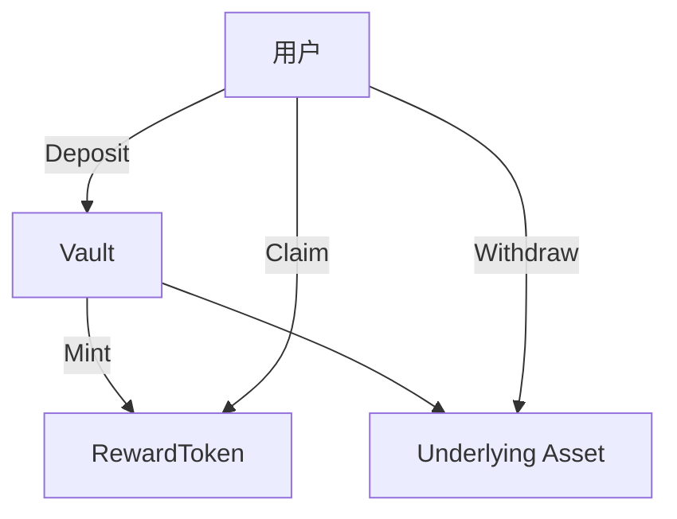

# 01 - 课程简介

本课程将从 0 到 1 构建“固定年化金库 + 奖励代币”的教学项目，覆盖合约、脚本、前端与测试。你将掌握 ERC4626 规范、线性计息与奖励发放、Hardhat 与前端集成等核心技能。

```mermaid
graph TD
  A[用户] -->|Deposit| B[Vault]
  B -->|Mint| C[RewardToken]
  B --> D[Underlying Asset]
  A -->|Claim| C
  A -->|Withdraw| D
```
