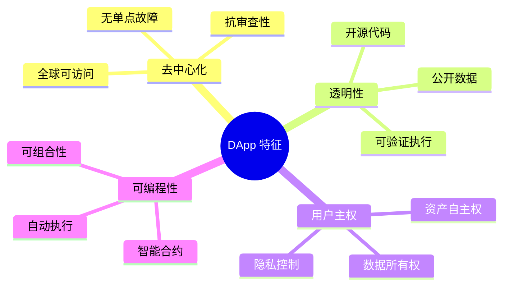
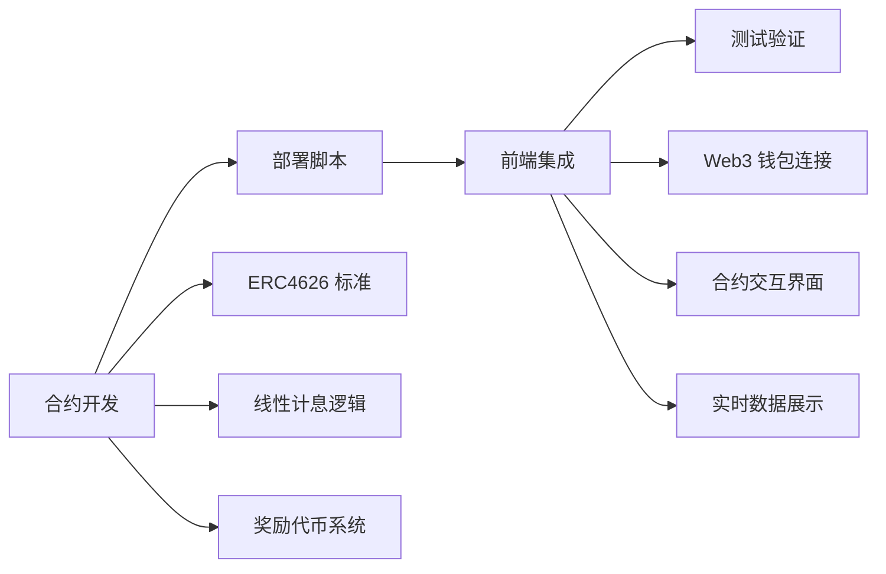

# 01 - 课程简介

本课程将从 0 到 1 构建"固定年化金库 + 奖励代币"的 DApp 教学项目，覆盖合约、脚本、前端与测试。你将掌握 ERC4626 规范、线性计息与奖励发放、Hardhat 与前端集成等核心技能。

## DApp 简介

去中心化应用（DApp）代表了 Web3 时代的新型应用架构。与传统应用相比，DApp 具有以下核心特征：

### DApp 核心特征

### 为什么选择 DApp？

| 优势 | 说明 | 本项目体现 |
|------|------|-----------|
| **透明性** | 所有代码和数据公开可验证 | 利率计算逻辑完全开源 |
| **去信任** | 无需信任第三方平台 | 合约自动执行，代码即法律 |
| **可编程货币** | 智能合约实现复杂金融逻辑 | 自动计息和奖励发放 |
| **全球化** | 7x24 小时，无地域限制 | 任何人都可参与固定收益 |
| **可组合性** | 可与其他 DeFi 协议集成 | 遵循 ERC4626 标准，易于集成 |

### 课程学习路径

本课程采用项目驱动的学习方式，从实践中掌握 DApp 开发：

通过本课程，你将亲手体验从传统开发思维向 Web3 开发思维的转变！