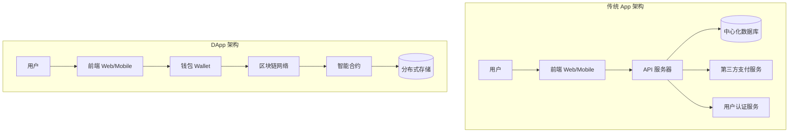
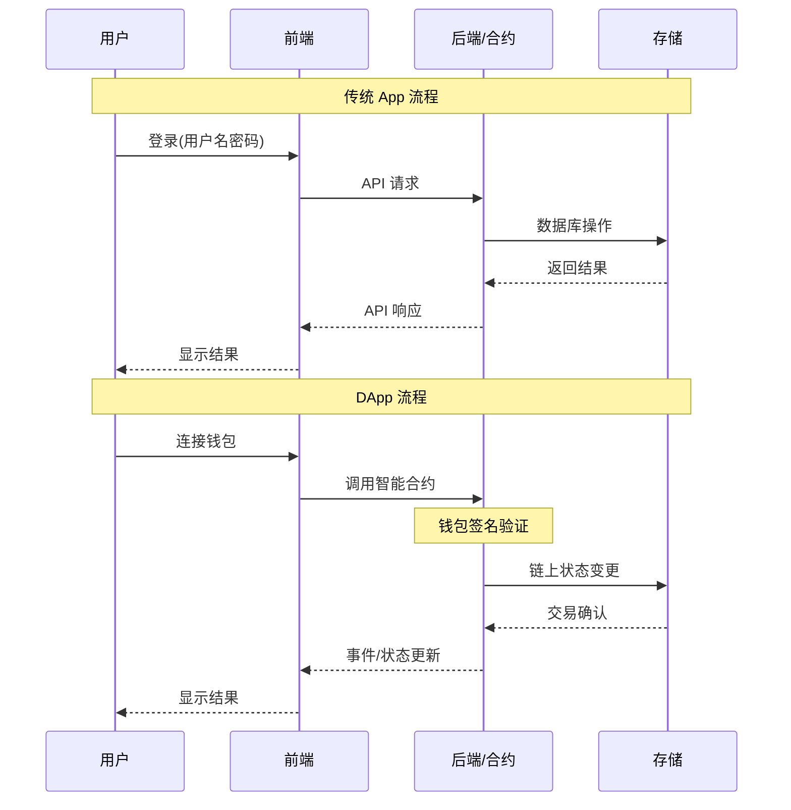
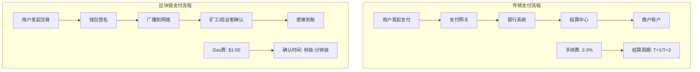
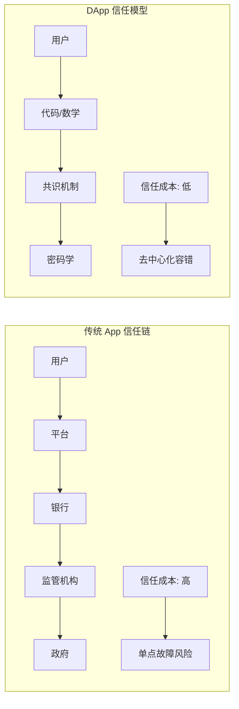
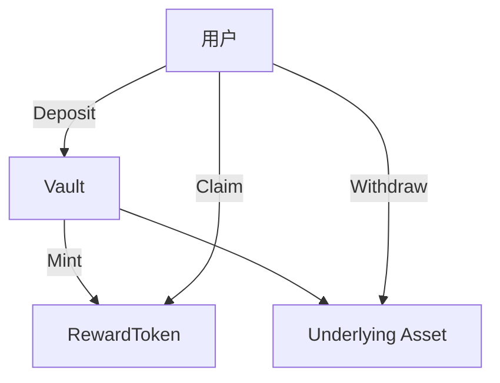

# 01 - 课程简介

本课程将从 0 到 1 构建"固定年化金库 + 奖励代币"的教学项目，覆盖合约、脚本、前端与测试。你将掌握 ERC4626 规范、线性计息与奖励发放、Hardhat 与前端集成等核心技能。

## DApp vs 传统 App 全方位对比

在深入学习之前，让我们先了解去中心化应用（DApp）与传统应用的根本差异：

### 架构对比

### 核心差异对比

| 维度 | 传统 App | DApp |
|------|----------|------|
| **数据存储** | 中心化数据库 | 区块链 + 分布式存储 |
| **用户认证** | 用户名密码/OAuth | 钱包私钥签名 |
| **数据所有权** | 平台拥有 | 用户拥有 |
| **服务可用性** | 依赖服务商 | 去中心化，抗审查 |
| **交易结算** | 依赖银行/支付平台 | 直接链上结算 |
| **开发复杂度** | 相对简单 | 需要区块链知识 |
| **用户体验** | 流畅 | 需要确认交易，有Gas费 |
| **可编程性** | 有限 | 智能合约可编程货币 |

### 交互流程对比

### 支付与结算对比

### 信任模型对比

### 我们的项目定位

本课程构建的固定年化金库项目体现了 DApp 的核心优势：

- **透明性**: 利率计算逻辑完全开源
- **去信任**: 无需信任平台，代码即法律
- **可编程**: 智能合约自动执行奖励发放
- **资产自主权**: 用户完全控制自己的资产

## 项目核心流程

通过本课程，你将亲手体验从传统开发思维向 Web3 开发思维的转变！