# 01.5 - DApp vs 传统应用深度对比

> 📖 **相关阅读**: 本文是 [01 - 课程简介](./01-intro.md) 的深度技术对比补充，建议先阅读课程简介了解项目概况。

## 技术栈对比

### 前端技术栈

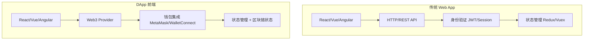

### 后端架构对比

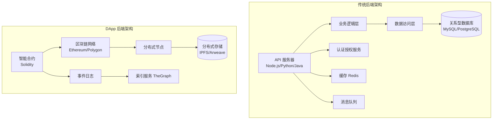

## 开发流程对比

### 传统应用开发流程

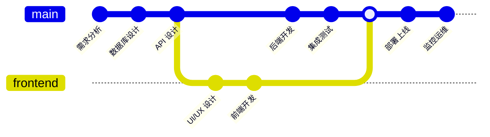

### DApp 开发流程

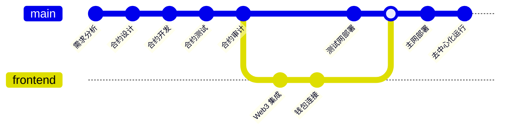

## 数据管理对比

### 数据存储方式

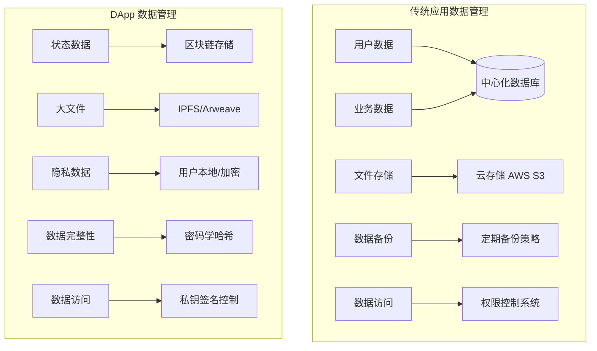

### 数据一致性保证

| 方面 | 传统应用 | DApp |
|------|----------|------|
| **一致性模型** | ACID 事务 | 最终一致性 |
| **冲突解决** | 数据库锁机制 | 共识算法 |
| **数据同步** | 主从复制 | P2P 网络同步 |
| **性能** | 高 TPS (数千/秒) | 低 TPS (10-1000/秒) |
| **可靠性** | 依赖备份策略 | 分布式冗余 |

## 用户体验对比

### 用户注册/登录流程

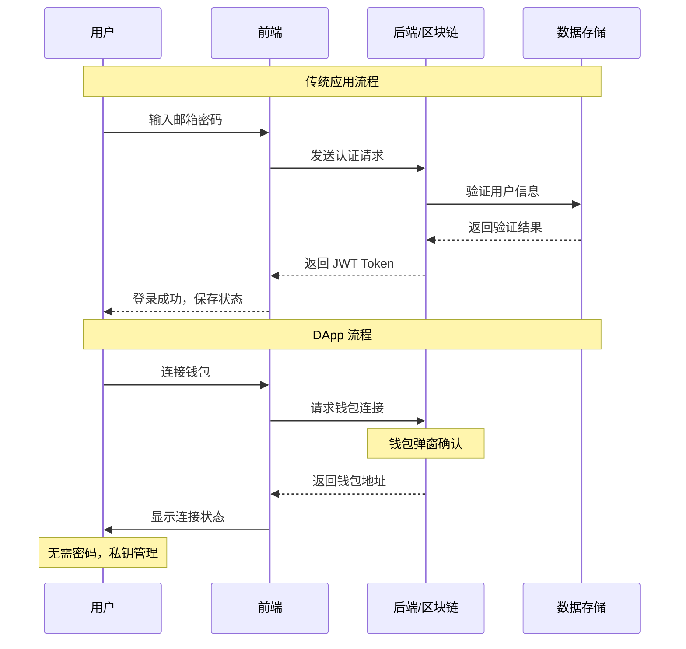

### 交易确认流程

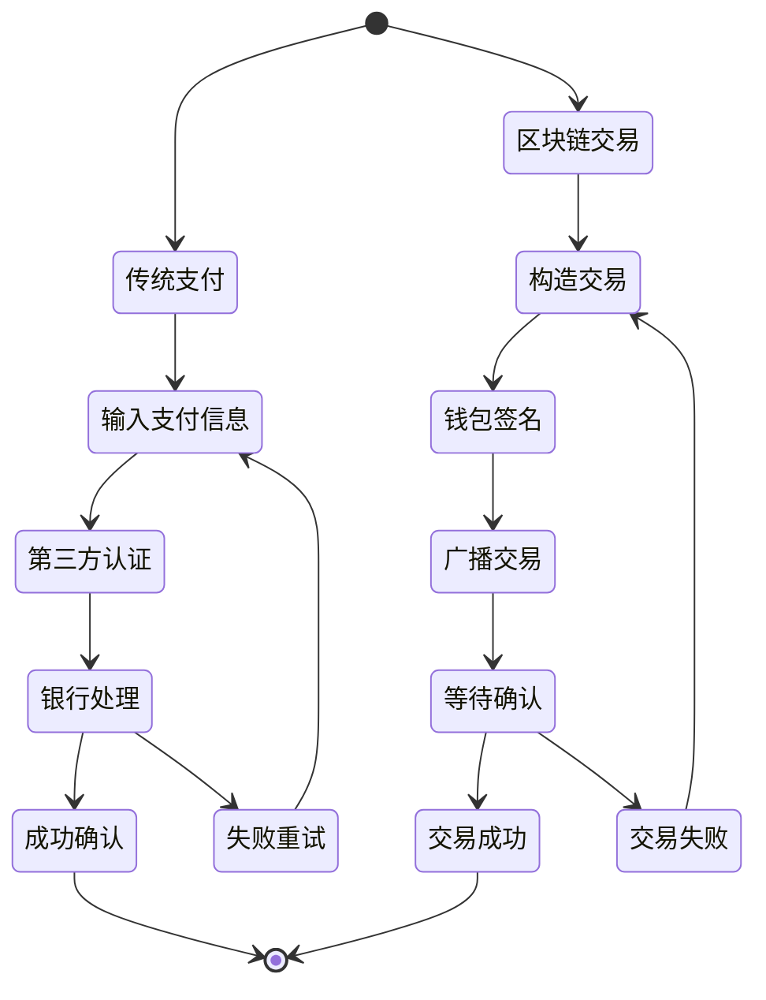

## 成本结构对比

### 开发与运营成本

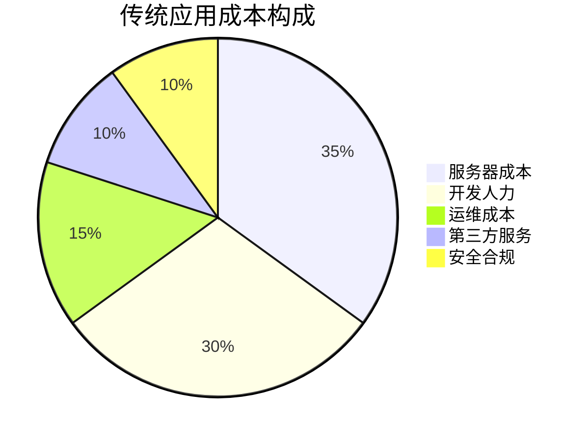

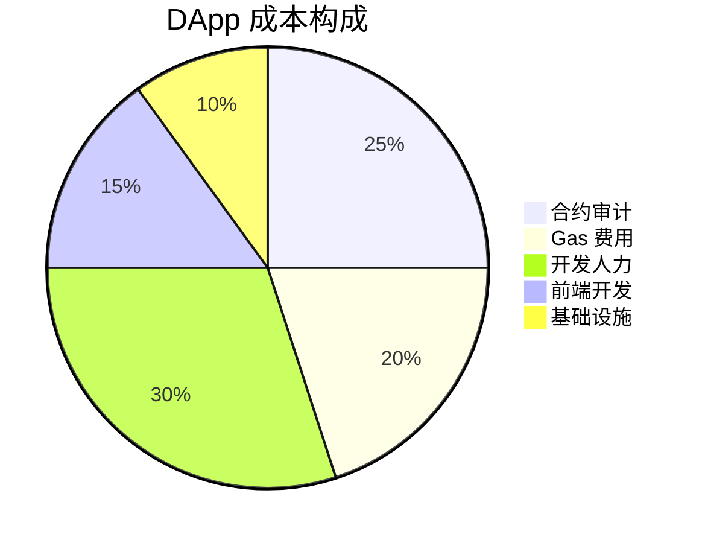

### 扩展性对比

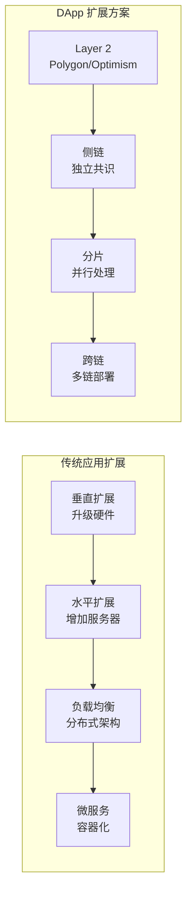

## 合规与监管对比

### 监管环境

| 方面 | 传统应用 | DApp |
|------|----------|------|
| **数据保护** | GDPR, CCPA 等严格要求 | 匿名化，难以删除 |
| **金融监管** | 银行牌照，反洗钱要求 | 监管不明确，合规挑战 |
| **税务处理** | 清晰的税收框架 | 复杂的加密资产税务 |
| **跨境合规** | 各国法律差异 | 去中心化难以管辖 |
| **用户保护** | 消费者权益保护法 | Code is Law |

## 未来发展趋势

### 技术融合趋势

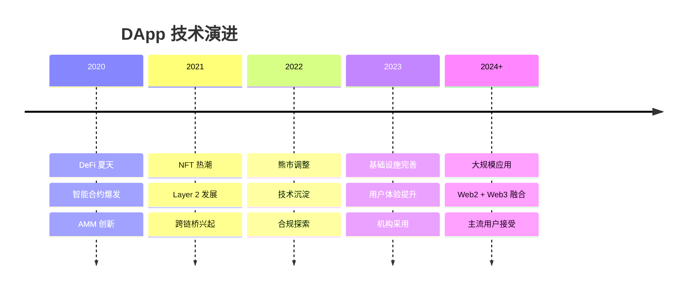

通过这个全方位对比，我们可以看到 DApp 和传统应用各有优劣。本课程的固定年化金库项目将帮助你深入理解 DApp 开发的核心概念和实践技巧！
