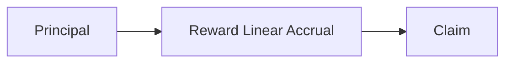

# 02 - Solidity 基础回顾

- **ERC20/4626**: 资产与份额标准接口
- **Ownable/ReentrancyGuard**: 管理权限与可重入保护
- **bps**: 基点，万分制利率（500 bps = 5%）
- **线性计息**: reward = principal * rateBps/10000 * elapsed/365d

```mermaid
flowchart LR
  P[Principal] --> R[Reward Linear Accrual]
  R --> C[Claim]
```
