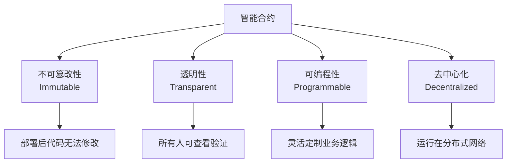
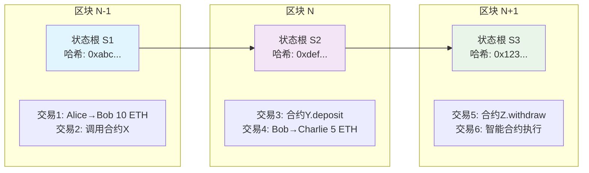
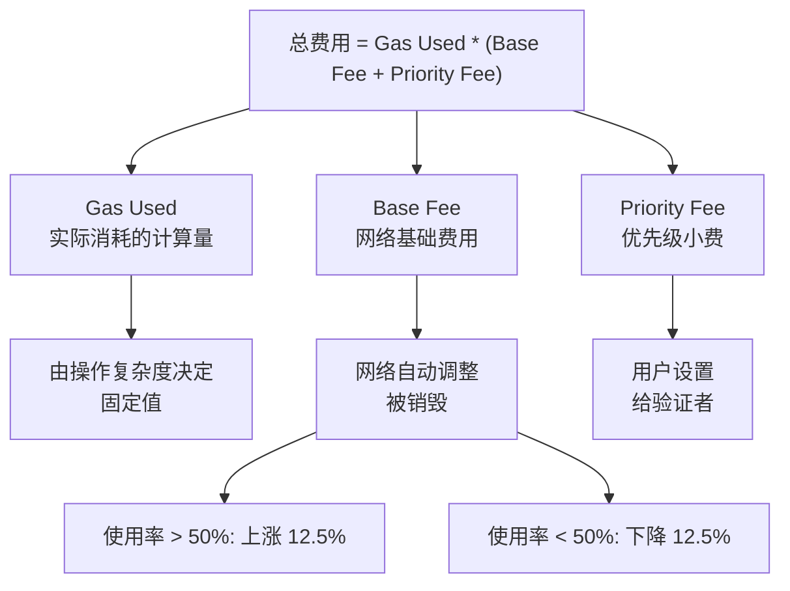
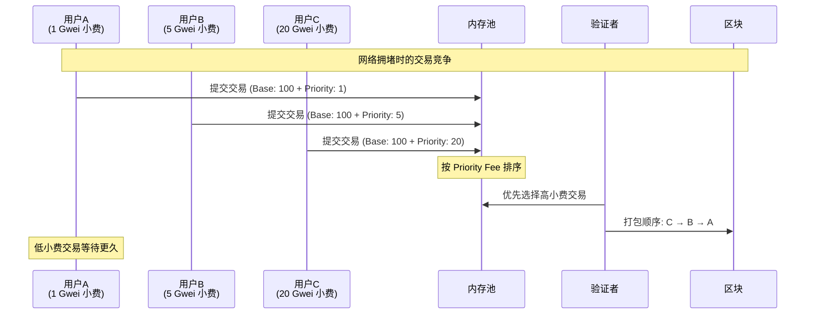
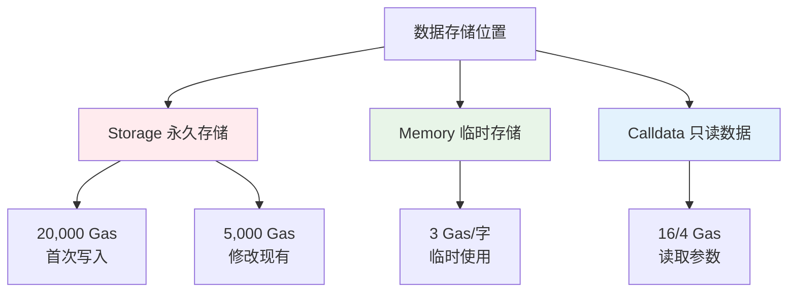
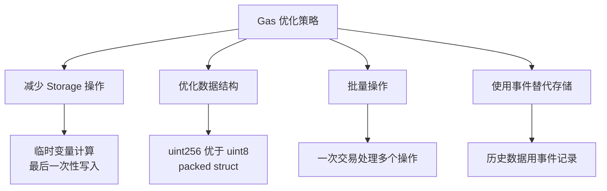

# 02 - 智能合约基础特性

## 什么是智能合约

Smart contracts are the fundamental building blocks of Ethereum's application layer. They are computer programs stored on the blockchain that follow "if this then that" logic, and are guaranteed to execute according to the rules defined by its code, which cannot be changed once created.

Nick Szabo coined the term "smart contract". In 1994, he wrote an introduction to the conceptopens in a new tab, and in 1996 he wrote an exploration of what smart contracts could doopens in a new tab.

Szabo envisioned a digital marketplace where automatic, cryptographically-secure processes enable transactions and business functions to happen without trusted intermediaries. Smart contracts on Ethereum put this vision into practice.

Watch Finematics explain smart contracts:
https://www.youtube.com/watch?v=pWGLtjG-F5c&t=3s

## 智能合约核心特性



**重要说明：** 
- **确定性**：在相同的输入和区块链状态下，合约总是产生相同的结果
- **自动执行**：一旦被触发且满足条件，合约会按照预设逻辑自动执行，无需人工干预

## 状态存储与执行环境

### 区块链状态机制

区块链是一个**全局状态机**，每个区块包含一组交易，这些交易会改变整个网络的状态。状态包括所有账户余额、合约存储数据等信息。

**链式结构与状态变化：**



**状态转换过程：**
1. **区块创建**：矿工收集待处理交易
2. **状态计算**：按顺序执行每笔交易，计算新状态
3. **状态根更新**：所有状态变化汇总为新的状态根哈希
4. **区块链接**：新区块通过哈希链接到前一个区块

每个区块的状态是基于前一个区块状态 + 当前区块所有交易的累积结果。

## Solidity 语言特性

### 数据类型基础

```solidity
// 基本数据类型
uint256 public totalSupply;        // 无符号整数
bool public isPaused;               // 布尔值
address public owner;               // 以太坊地址
bytes32 public dataHash;           // 固定长度字节

// 映射类型
mapping(address => uint256) public balances;

// 数组
uint256[] public prices;
```

### 函数修饰符与可见性

**可见性修饰符：**
- `public` - 内部和外部都可调用
- `external` - 只能从外部调用
- `internal` - 内部和继承合约可调用
- `private` - 只能在当前合约内调用

**状态修饰符：**
- `view` - 只读函数，不修改状态
- `pure` - 纯函数，不读取也不修改状态
- `payable` - 可以接收 ETH 的函数

```solidity
contract VisibilityExample {
    uint256 private _value;
    
    function getValue() public view returns (uint256) {
        return _value;  // view: 只读取状态
    }
    
    function add(uint256 a, uint256 b) public pure returns (uint256) {
        return a + b;   // pure: 不访问状态
    }
    
    function deposit() external payable {
        _value += msg.value;  // payable: 可接收 ETH
    }
}
```

### Gas 机制

**Gas 是什么？**
Gas 是以太坊网络的"燃料"，每个操作都需要消耗一定的 Gas。用户支付 Gas 费用来激励矿工/验证者执行交易。

#### EIP-1559: 现代 Gas 费用机制

以太坊 2021 年引入 EIP-1559，改变了 Gas 费用计算方式：



**网络拥堵时费用飙升的原因：**

1. **有限的区块空间**：每个区块只能容纳约 30M Gas
2. **Base Fee 自动调整**：高使用率推高基础费用
3. **Priority Fee 竞价**：用户提高小费争夺优先级



**实际费用计算示例：**

| 网络状态 | Base Fee | Priority Fee | 总费用 | 说明 |
|---------|----------|--------------|--------|------|
| 空闲 | 8 Gwei | 1 Gwei | 9 Gwei | 快速确认 |
| 正常 | 15 Gwei | 2 Gwei | 17 Gwei | 1-2 分钟确认 |
| 繁忙 | 40 Gwei | 5 Gwei | 45 Gwei | 可能需要等待 |
| 拥堵 | 120 Gwei | 20 Gwei | 140 Gwei | 长时间等待 |

```solidity
// 一个简单转账的费用计算
// Gas Used: 21,000 (转账固定消耗)
// Gas Price: 50 Gwei

uint256 totalFee = 21000 * 50 * 10**9;  // 1,050,000,000,000,000 wei
// = 0.00105 ETH (约 $2-5，取决于 ETH 价格)
```

**存储类型与 Gas 消耗：**



**实际 Gas 消耗示例：**

```solidity
contract GasExample {
    uint256 public storageVar;           // Storage: 昂贵
    mapping(address => uint256) public balances;  // Storage: 昂贵
    
    function gasComparison() external {
        // ❌ 高 Gas 消耗
        storageVar = 100;                // ~20,000 Gas (首次写入)
        storageVar = 200;                // ~5,000 Gas (修改)
        
        // ✅ 低 Gas 消耗
        uint256 tempVar = 100;           // ~3 Gas (memory)
        uint256 result = tempVar + 50;   // ~3 Gas (memory)
        
        // 最后一次性写入 storage
        storageVar = result;             // ~5,000 Gas
    }
    
    function optimizedFunction(uint256[] calldata data) external {
        uint256 sum = 0;                 // Memory 变量
        
        // ✅ 使用 calldata 读取，便宜
        for (uint i = 0; i < data.length; i++) {
            sum += data[i];              // 读取 calldata: ~16 Gas/字
        }
        
        // 一次性写入结果
        storageVar = sum;                // 只有一次 storage 写入
    }
}
```

#### Gas 优化策略

理解 Gas 机制后，我们可以采用以下策略优化合约：



**实际 Gas 成本对比：**

| 操作类型 | Gas 消耗 | 实际成本 (50 Gwei) | 说明 |
|---------|----------|------------------|------|
| 简单转账 | 21,000 | $2-5 | 基础操作 |
| ERC20 转账 | 65,000 | $6-15 | 合约调用 |
| Uniswap 交换 | 150,000 | $15-35 | 复杂 DeFi |
| NFT 铸造 | 80,000 | $8-20 | 存储 + 事件 |

**开发者建议：**
- 在测试网充分测试 Gas 消耗
- 使用 Gas Reporter 工具分析成本
- 考虑 Layer 2 方案降低费用

## 事件与日志

智能合约通过事件机制记录重要操作，事件会写入区块链日志，消耗的 Gas 比存储数据便宜得多。前端应用可以监听这些事件来更新界面，也可以用于历史数据查询和链下分析。

### 事件定义与使用

```solidity
contract VaultExample {
    // 定义事件 - 使用 indexed 关键字便于过滤
    event Deposited(address indexed user, uint256 amount, uint256 timestamp);
    event Withdrawn(address indexed user, uint256 amount);
    event RewardClaimed(address indexed user, uint256 rewardAmount);
    
    mapping(address => uint256) public balances;
    
    function deposit() external payable {
        require(msg.value > 0, "Amount must be > 0");
        
        balances[msg.sender] += msg.value;
        
        // 触发事件 - 记录操作历史
        emit Deposited(msg.sender, msg.value, block.timestamp);
    }
    
    function withdraw(uint256 amount) external {
        require(balances[msg.sender] >= amount, "Insufficient balance");
        
        balances[msg.sender] -= amount;
        payable(msg.sender).transfer(amount);
        
        // 触发事件
        emit Withdrawn(msg.sender, amount);
    }
}
```

### indexed 参数的作用

- **最多 3 个 indexed 参数**：可以作为过滤条件
- **非 indexed 参数**：存储在事件数据中，Gas 消耗更低
- **前端过滤**：可以根据 indexed 参数快速查找特定事件

```solidity
// 前端 JavaScript 示例
const contract = new ethers.Contract(address, abi, provider);

// 监听特定用户的存款事件
contract.on("Deposited", (user, amount, timestamp) => {
    console.log(`User ${user} deposited ${amount} at ${timestamp}`);
});

// 过滤查询历史事件
const filter = contract.filters.Deposited("0x123..."); // 只查询特定用户
const events = await contract.queryFilter(filter);
```

## 速通版

对于有编程基础的同学，可以通过这张图快速了解 Solidity 语法全貌：

📖 [点击查看：Solidity 语法速查图](../../resource/SolidityInOnePicture.png)

## 下一步

掌握了这些智能合约基础特性后，我们将在下一章学习如何设计和实现具体的金库合约。