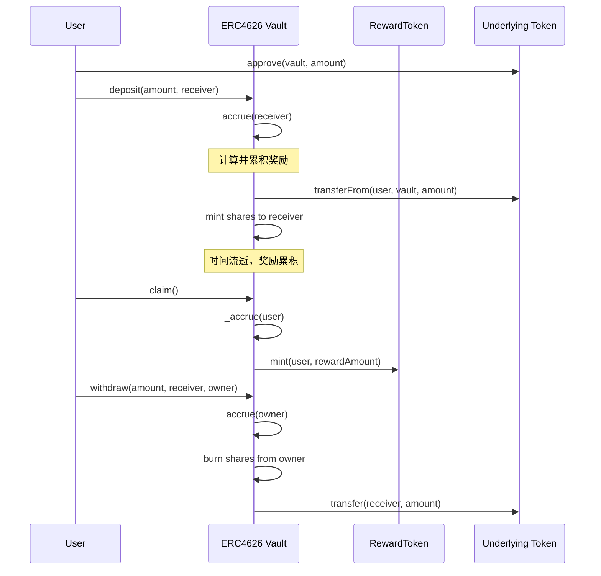

# 03 - Vault 合约实现要点

## ERC4626 固定利率金库

基于 OpenZeppelin ERC4626 标准实现的固定年化收益金库：

### 核心特性
- **标准化接口**: 遵循 ERC4626 标准 `deposit/mint/withdraw/redeem`
- **线性计息**: 基于时间线性累积奖励
- **奖励机制**: 通过独立 RewardToken 发放奖励
- **重入保护**: 所有公开函数都有 `nonReentrant` 保护

### 实现要点
- **计息触发**: 在每次 `deposit/mint/withdraw/redeem` 入口处调用 `_accrue`
- **精度控制**: 使用中间步骤计算避免溢出，提高精度
- **权限管理**: Owner 可调整年化利率
- **事件记录**: 完整的操作和利率变更事件



### 计息算法
```solidity
// 年化利率转实时奖励
uint256 rewardRate = (assets * annualRateBps) / 10_000;
uint256 linearReward = (rewardRate * elapsed) / ONE_YEAR;
```

### 安全考虑
- CEI 模式（检查-效果-交互）
- 重入保护
- 溢出保护
- 权限控制
