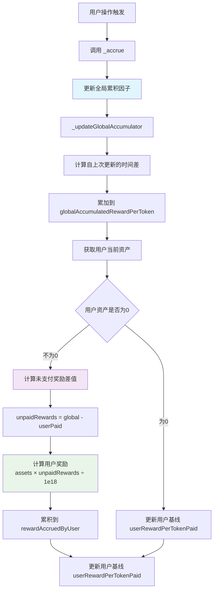
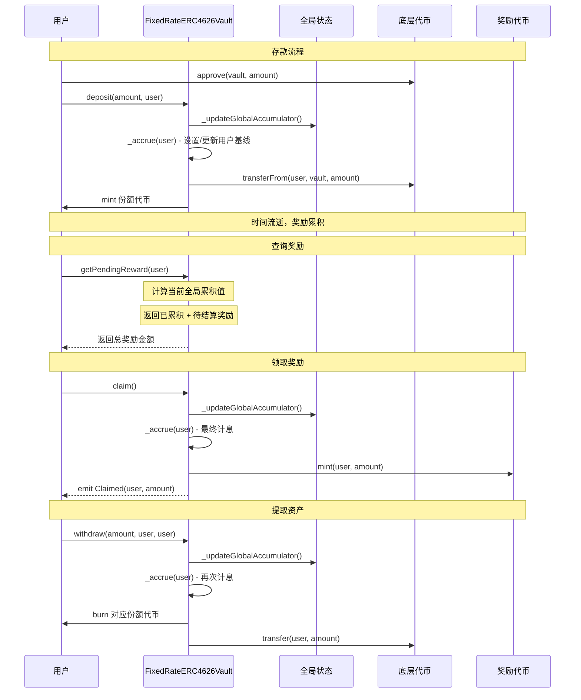

# 03 - Vault 合约实现要点

基于前面学习的智能合约基础知识，我们来深入了解 FixedRateERC4626Vault 的具体实现。

## 合约架构设计

### 继承结构
```solidity
contract FixedRateERC4626Vault is ERC4626, Ownable, ReentrancyGuard {
    // 组合了三个 OpenZeppelin 合约的功能
}
```

- **ERC4626**: 标准化金库接口，提供 deposit/withdraw 等功能
- **Ownable**: 所有者权限管理，用于调整利率
- **ReentrancyGuard**: 重入攻击保护，确保函数安全执行

### 核心状态变量

```solidity
contract FixedRateERC4626Vault {
    IRewardToken public immutable rewardToken;           // 奖励代币合约
    uint256 public annualRateBps;                        // 年化利率（基点）
    
    // 全局累积因子系统
    uint256 public globalAccumulatedRewardPerToken;      // 全局累积奖励/代币（1e18精度）
    uint256 public lastUpdateTimestamp;                  // 全局上次更新时间
    
    mapping(address => uint256) public rewardAccruedByUser;    // 用户累积奖励
    mapping(address => uint256) public userRewardPerTokenPaid; // 用户已付奖励/代币（1e18精度）
    
    uint256 private constant ONE_YEAR = 365 days;        // 一年的秒数
}
```

**状态变量详解**：
- `globalAccumulatedRewardPerToken`: 记录从合约创建以来每个代币累积的总奖励（缩放1e18倍）
- `lastUpdateTimestamp`: 全局累积因子的上次更新时间
- `userRewardPerTokenPaid`: 记录用户上次结算时的全局累积值，用于计算差值奖励

## 核心机制解析

### 1. 全局累积因子机制

本合约采用全局累积因子算法，这是 DeFi 协议中广泛使用的高效利息计算方法：

```solidity
// 核心公式
用户奖励 = 用户资产 × (当前全局累积值 - 用户上次结算值) / 1e18
```

**机制优势**：
- ✅ **O(1) 复杂度**：无论存款次数多少，计算时间恒定
- ✅ **精确计息**：每笔存款按实际时间计息，无重复计算
- ✅ **DeFi 标准**：与 Compound、Aave 等主流协议相同的数学模型

### 2. 动态命名机制
```solidity
constructor(ERC20 asset_, address rewardToken_, uint256 annualRateBps_) 
    ERC20(
        string.concat("fy-", ERC20(address(asset_)).name()),    // fy-USD Coin
        string.concat("fy", ERC20(address(asset_)).symbol())    // fyUSDC
    ) ERC4626(asset_) Ownable(msg.sender) {
    // 构造函数逻辑
}
```

金库代币的名称和符号会根据底层资产自动生成，如底层是 USDC，则金库代币为 "fy-USD Coin" (fyUSDC)。

### 3. 全局累积因子更新机制

在每次计息前，都会先更新全局累积因子：

```solidity
function _updateGlobalAccumulator() internal {
    if (totalSupply() == 0) {
        lastUpdateTimestamp = block.timestamp;
        return;
    }
    
    uint256 elapsed = block.timestamp - lastUpdateTimestamp;
    if (elapsed == 0) return;
    
    // 计算本时间段的每代币奖励率（1e18精度）
    uint256 rewardPerToken = (annualRateBps * elapsed * 1e18) / (10_000 * ONE_YEAR);
    globalAccumulatedRewardPerToken += rewardPerToken;
    lastUpdateTimestamp = block.timestamp;
}
```

### 4. 计息触发机制

所有 ERC4626 标准函数都被重写，添加了新的计息逻辑：

```solidity
function deposit(uint256 assets, address receiver) public override nonReentrant returns (uint256) {
    _accrue(receiver);           // 先用全局累积因子计息
    return super.deposit(assets, receiver);  // 再执行标准逻辑
}

function withdraw(uint256 assets, address receiver, address owner_) public override nonReentrant returns (uint256) {
    _accrue(owner_);            // 为代币所有者计息
    return super.withdraw(assets, receiver, owner_);
}
```

**关键设计**：每次用户操作前都会自动更新全局状态并计算差值奖励，确保奖励精确且不会丢失。

### 5. 计息算法（全局累积因子）



**新的代码实现**：
```solidity
function _accrue(address user) internal {
    _updateGlobalAccumulator();  // 先更新全局累积因子
    
    uint256 assets = convertToAssets(balanceOf(user));
    if (assets == 0) {
        // 即使资产为0也要更新用户基线
        userRewardPerTokenPaid[user] = globalAccumulatedRewardPerToken;
        return;
    }
    
    // 计算未支付的奖励（差值方式）
    uint256 unpaidRewards = globalAccumulatedRewardPerToken - userRewardPerTokenPaid[user];
    if (unpaidRewards > 0) {
        // 转换奖励：(assets * unpaidRewards) / 1e18
        rewardAccruedByUser[user] += (assets * unpaidRewards) / 1e18;
    }
    
    // 更新用户基线到当前全局状态
    userRewardPerTokenPaid[user] = globalAccumulatedRewardPerToken;
}
```


### 6. 奖励查询与领取

**实时查询**（view 函数，不修改状态）：
```solidity
function getPendingReward(address user) external view returns (uint256) {
    uint256 baseAccrued = rewardAccruedByUser[user];
    uint256 assets = convertToAssets(balanceOf(user));
    
    if (assets == 0) return baseAccrued;
    
    // 计算当前的全局累积值（不修改状态）
    uint256 currentGlobalAccumulated = globalAccumulatedRewardPerToken;
    if (totalSupply() > 0) {
        uint256 elapsed = block.timestamp - lastUpdateTimestamp;
        if (elapsed > 0) {
            uint256 additionalRewardPerToken = (annualRateBps * elapsed * 1e18) / (10_000 * ONE_YEAR);
            currentGlobalAccumulated += additionalRewardPerToken;
        }
    }
    
    // 计算待领取奖励
    uint256 unpaidRewards = currentGlobalAccumulated - userRewardPerTokenPaid[user];
    uint256 pendingRewards = (assets * unpaidRewards) / 1e18;
    
    return baseAccrued + pendingRewards;
}
```

**奖励领取**：
```solidity
function claim() external nonReentrant {
    _accrue(msg.sender);                              // 先更新奖励
    uint256 amount = rewardAccruedByUser[msg.sender]; // 获取总奖励
    require(amount > 0, "nothing");                   // 检查是否有奖励
    rewardAccruedByUser[msg.sender] = 0;              // 清零已领取
    rewardToken.mint(msg.sender, amount);             // 铸造奖励代币
    emit Claimed(msg.sender, amount);                 // 触发事件
}
```

## 完整交互流程



## 安全设计

### 1. 重入保护
所有公开函数都使用 `nonReentrant` 修饰符，防止恶意合约重入攻击。

### 2. 数学安全性
```solidity
// 使用1e18精度缩放，避免精度丢失
uint256 rewardPerToken = (annualRateBps * elapsed * 1e18) / (10_000 * ONE_YEAR);

// 差值计算避免时间戳操控
uint256 unpaidRewards = globalAccumulatedRewardPerToken - userRewardPerTokenPaid[user];
```

### 3. 边界检查与验证
- 年化利率不能超过 100%（10,000 bps）
- 奖励代币地址不能为零地址
- 零资产时正确更新用户基线
- 领取奖励前检查余额

### 4. 权限分离
- **Owner**：只能调整利率
- **RewardToken**：只有 Vault 能 mint 奖励  
- **用户**：只能操作自己的资产和奖励

## 运行测试用例

确保您在项目根目录下运行测试：

```bash
# 运行所有测试
npx hardhat test
```

## 下一步

在下一章中，我们将学习如何使用 Hardhat 部署这个合约，并通过脚本进行交互测试。