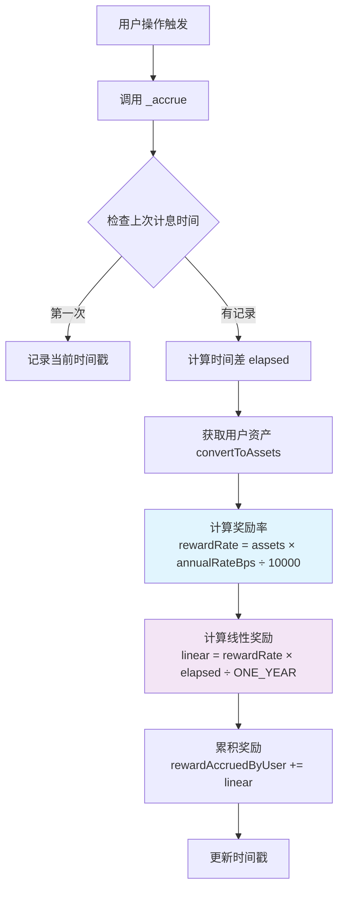
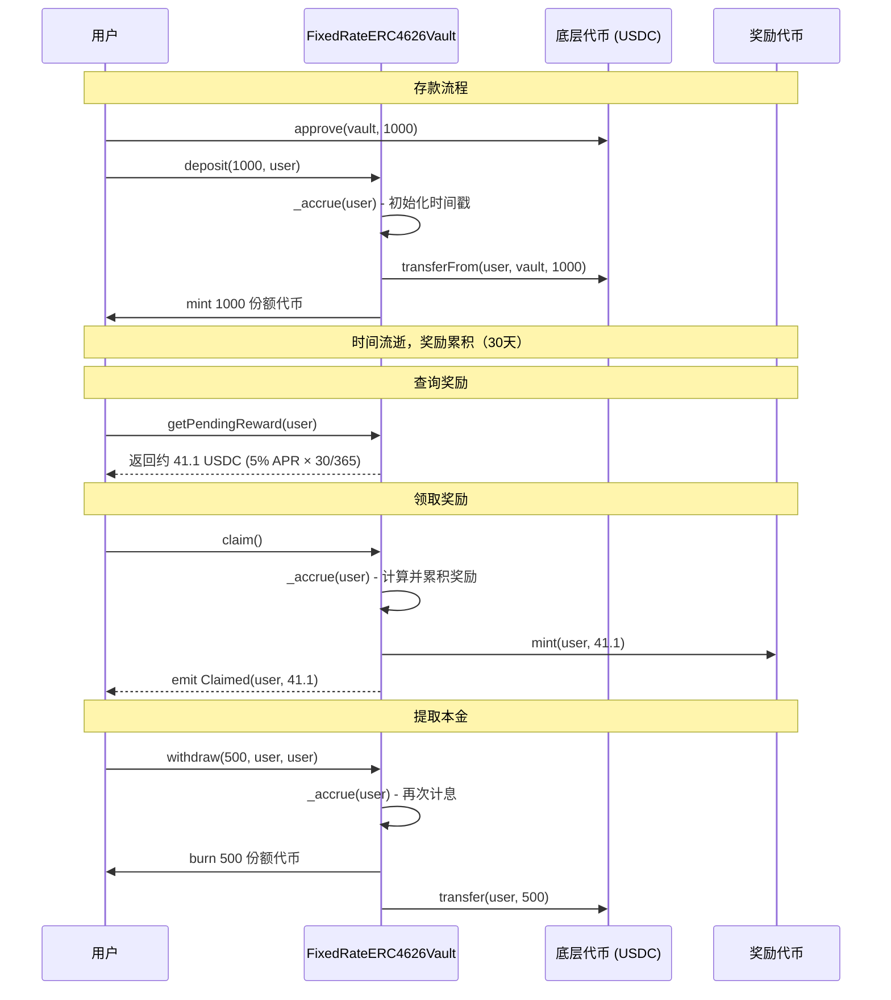

# 03 - Vault 合约实现要点

基于前面学习的智能合约基础知识，我们来深入了解 FixedRateERC4626Vault 的具体实现。

## 合约架构设计

### 继承结构
```solidity
contract FixedRateERC4626Vault is ERC4626, Ownable, ReentrancyGuard {
    // 组合了三个 OpenZeppelin 合约的功能
}
```

- **ERC4626**: 标准化金库接口，提供 deposit/withdraw 等功能
- **Ownable**: 所有者权限管理，用于调整利率
- **ReentrancyGuard**: 重入攻击保护，确保函数安全执行

### 核心状态变量

```solidity
contract FixedRateERC4626Vault {
    IRewardToken public immutable rewardToken;           // 奖励代币合约
    uint256 public annualRateBps;                        // 年化利率（基点）
    
    mapping(address => uint256) public rewardAccruedByUser;      // 用户累积奖励
    mapping(address => uint256) public lastAccrueTimestampByUser; // 上次计息时间
    
    uint256 private constant ONE_YEAR = 365 days;        // 一年的秒数
}
```

## 核心机制解析

### 1. 动态命名机制
```solidity
constructor(ERC20 asset_, address rewardToken_, uint256 annualRateBps_) 
    ERC20(
        string.concat("fy-", ERC20(address(asset_)).name()),    // fy-USD Coin
        string.concat("fy", ERC20(address(asset_)).symbol())    // fyUSDC
    ) ERC4626(asset_) Ownable(msg.sender) {
    // 构造函数逻辑
}
```

金库代币的名称和符号会根据底层资产自动生成，如底层是 USDC，则金库代币为 "fy-USD Coin" (fyUSDC)。

### 2. 计息触发机制

所有 ERC4626 标准函数都被重写，添加了计息逻辑：

```solidity
function deposit(uint256 assets, address receiver) public override nonReentrant returns (uint256) {
    _accrue(receiver);           // 先计息
    return super.deposit(assets, receiver);  // 再执行标准逻辑
}

function withdraw(uint256 assets, address receiver, address owner_) public override nonReentrant returns (uint256) {
    _accrue(owner_);            // 为代币所有者计息
    return super.withdraw(assets, receiver, owner_);
}
```

**关键设计**：每次用户操作前都会自动计算并累积奖励，确保奖励不会丢失。

### 3. 核心计息算法



**实际代码实现**：
```solidity
function _accrue(address user) internal {
    uint256 last = lastAccrueTimestampByUser[user];
    if (last == 0) {
        lastAccrueTimestampByUser[user] = block.timestamp;
        return;
    }
    
    uint256 assets = convertToAssets(balanceOf(user));
    if (assets == 0) {
        lastAccrueTimestampByUser[user] = block.timestamp;
        return;
    }
    
    uint256 elapsed = block.timestamp - last;
    if (elapsed == 0) return;
    
    // 防溢出的精确计算
    uint256 rewardRate = (assets * annualRateBps) / 10_000;
    uint256 linear = (rewardRate * elapsed) / ONE_YEAR;
    rewardAccruedByUser[user] += linear;
    lastAccrueTimestampByUser[user] = block.timestamp;
}
```

### 4. 奖励查询与领取

**实时查询**（view 函数，不修改状态）：
```solidity
function getPendingReward(address user) external view returns (uint256) {
    uint256 baseAccrued = rewardAccruedByUser[user];
    uint256 last = lastAccrueTimestampByUser[user];
    
    if (last == 0) return baseAccrued;
    
    uint256 assets = convertToAssets(balanceOf(user));
    if (assets == 0) return baseAccrued;
    
    uint256 elapsed = block.timestamp - last;
    if (elapsed == 0) return baseAccrued;
    
    uint256 rewardRate = (assets * annualRateBps) / 10_000;
    uint256 linear = (rewardRate * elapsed) / ONE_YEAR;
    return baseAccrued + linear;
}
```

**奖励领取**：
```solidity
function claim() external nonReentrant {
    _accrue(msg.sender);                              // 先更新奖励
    uint256 amount = rewardAccruedByUser[msg.sender]; // 获取总奖励
    require(amount > 0, "nothing");                   // 检查是否有奖励
    rewardAccruedByUser[msg.sender] = 0;              // 清零已领取
    rewardToken.mint(msg.sender, amount);             // 铸造奖励代币
    emit Claimed(msg.sender, amount);                 // 触发事件
}
```

## 完整交互流程



## 安全设计亮点

### 1. 重入保护
所有公开函数都使用 `nonReentrant` 修饰符，防止恶意合约重入攻击。

### 2. 精度保护
```solidity
// 使用中间变量避免计算溢出
uint256 rewardRate = (assets * annualRateBps) / 10_000;
uint256 linear = (rewardRate * elapsed) / ONE_YEAR;
```

### 3. 边界检查
- 年化利率不能超过 100%（10,000 bps）
- 奖励代币地址不能为零地址
- 领取奖励前检查余额

### 4. 权限分离
- Owner：只能调整利率
- RewardToken：只有 Vault 能 mint 奖励
- 用户：只能操作自己的资产

## 下一步

在下一章中，我们将学习如何使用 Hardhat 部署这个合约，并通过脚本进行交互测试。