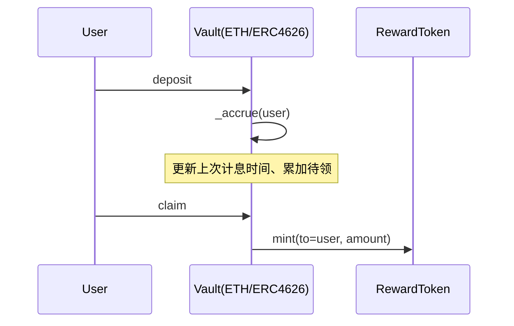

# 03 - Vault 合约实现要点

- **ETH Vault**: 存取 ETH、线性计息、奖励代币 mint、CEI、`call` 转账
- **ERC4626 Vault**: 遵循标准 `deposit/mint/withdraw/redeem`，在入口处 `_accrue`

```mermaid
sequenceDiagram
  participant U as User
  participant V as Vault(ETH/ERC4626)
  participant R as RewardToken
  U->>V: deposit
  V->>V: _accrue(user)
  Note over V: 更新上次计息时间、累加待领
  U->>V: claim
  V->>R: mint(to=user, amount)
```
