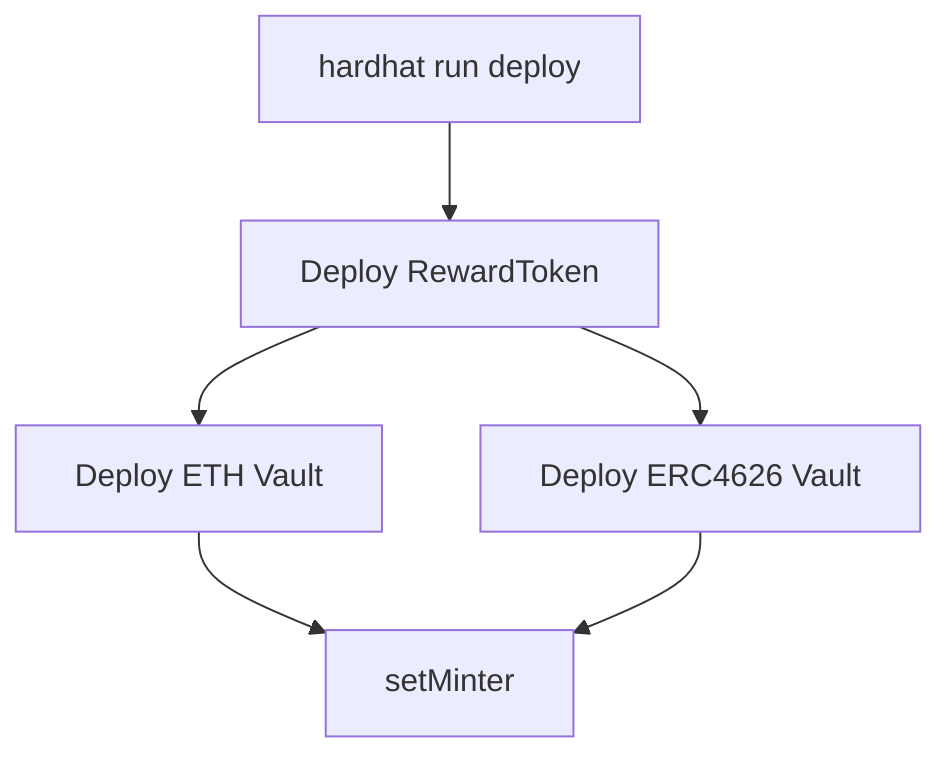

# 04 - Hardhat 部署与交互

- 复制 `.env.example` 为 `.env`
- `npm install && npx hardhat compile`
- `npx hardhat run scripts/deploy.ts --network sepolia`

```mermaid
flowchart TD
  A[hardhat run deploy] --> B[Deploy RewardToken]
  B --> C[Deploy ETH Vault]
  B --> D[Deploy ERC4626 Vault]
  C --> E[setMinter]
  D --> E
```
