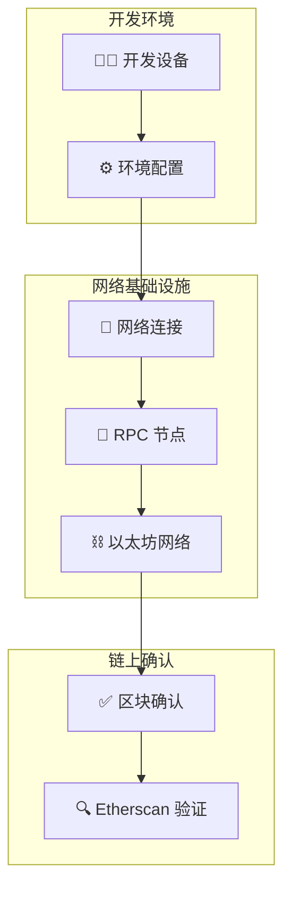
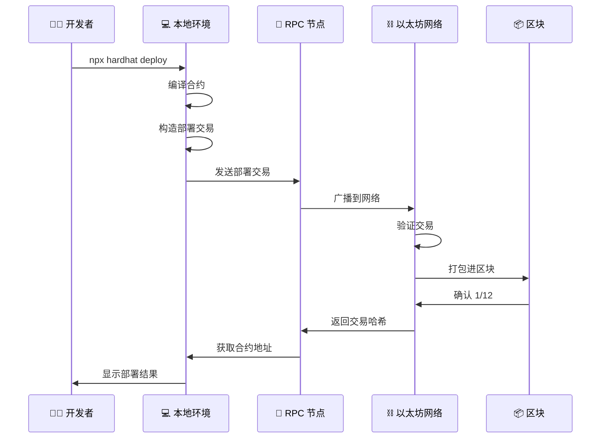
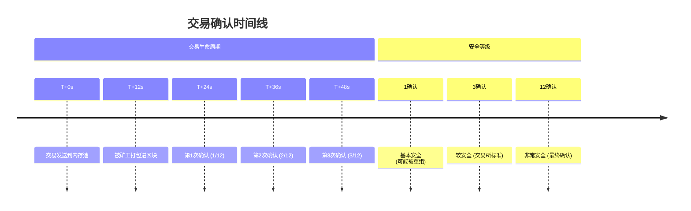
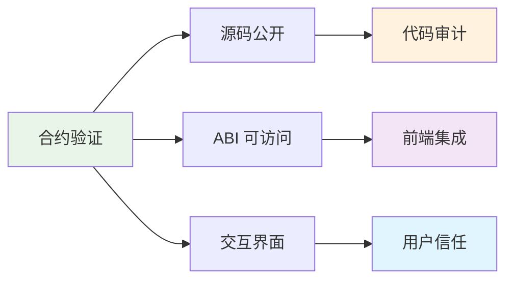

# 04 - 合约部署完整流程

本章将带你完整体验从开发环境到区块链网络的合约部署全流程，包括环境配置、网络连接、交易确认、合约验证等关键环节。

## 部署流程全景图



## 1. 开发设备环境准备

### 本地开发环境
```bash
# 确保 Node.js 版本 >= 18
node --version

# 安装项目依赖
npm install

# 编译合约检查语法
npx hardhat compile
```

### 环境变量配置
创建 `.env` 文件：

```bash
# RPC 节点配置
SEPOLIA_RPC_URL=https://sepolia.infura.io/v3/YOUR_PROJECT_ID
# 或使用 Alchemy: https://eth-sepolia.g.alchemy.com/v2/YOUR_API_KEY

# 部署者私钥
PRIVATE_KEY=0x... # ⚠️ 仅用于测试网，注意安全

# 合约验证
ETHERSCAN_API_KEY=YOUR_ETHERSCAN_API_KEY
```

### 获取测试代币
```bash
# Sepolia 水龙头
# https://sepoliafaucet.com/
# https://faucet.sepolia.dev/
```

## 2. 部署配置与网络连接

### Hardhat 网络配置
**hardhat.config.ts** 网络设置：

```typescript
const config: HardhatUserConfig = {
  networks: {
    sepolia: {
      url: process.env.SEPOLIA_RPC_URL,
      accounts: [process.env.PRIVATE_KEY!],
      chainId: 11155111,
    }
  }
};
```

### RPC 节点服务商

| 服务商 | 特点 | 限制 |
|--------|------|------|
| **Infura** | 稳定性高，企业级 | 免费层：100k 请求/天 |
| **Alchemy** | 功能丰富，调试工具 | 免费层：300M 计算单元/月 |
| **QuickNode** | 性能优化，低延迟 | 免费层有限 |
| **公共节点** | 完全免费 | 可能不稳定，限流 |

## 3. 合约部署执行

### 部署命令执行
```bash
# 执行部署到 Sepolia
npx hardhat ignition deploy ignition/modules/FixedYieldVaults.ts --network sepolia

# 输出示例：
✔ Confirm deploy to network sepolia (11155111)? … yes
Hardhat Ignition 🚀

Deploying [ FixedYieldVaultsModule ]

Batch #1
  Executed FixedYieldVaultsModule#MockERC20

Batch #2  
  Executed FixedYieldVaultsModule#RewardToken

Batch #3
  Executed FixedYieldVaultsModule#FixedRateERC4626Vault

Batch #4
  Executed FixedYieldVaultsModule#SetMinter

✅ Deployment complete
```

### 部署过程详解



## 4. 区块确认机制

### 确认过程详解



### Gas 费用与确认时间

| Gas Price | 确认时间 | 适用场景 |
|-----------|----------|----------|
| 慢速 (10 Gwei) | 5-30 分钟 | 非紧急部署 |
| 标准 (20 Gwei) | 1-5 分钟 | 常规部署 |
| 快速 (50 Gwei) | 15-60 秒 | 紧急部署 |

## 5. Etherscan 验证

### 自动验证
```bash
# 部署完成后立即验证所有合约
npx hardhat ignition verify chain-11155111 --include-unrelated-contracts

# 验证成功输出：
✅ MockERC20 verified
✅ RewardToken verified  
✅ FixedRateERC4626Vault verified
```

### 验证的重要性



**验证的价值**：
- ✅ **透明度**：用户可查看实际合约代码
- ✅ **可信度**：证明部署的代码与开源代码一致
- ✅ **易用性**：Etherscan 提供直接交互界面
- ✅ **集成性**：前端可自动获取 ABI

## 6. 部署后配置

### 合约地址管理
```bash
# 地址保存位置
ignition/deployments/chain-11155111/deployed_addresses.json

# 示例地址：
{
  "MockERC20": "0x87CD692f80994C8b23D600d697AF5460035AfaC6",
  "RewardToken": "0x708370bFf84Fee18a285B7Eb3CdfBc42B151eb03", 
  "FixedRateERC4626Vault": "0x84538aAB4b9514241cAA4e7a4f601F066E93bF9c"
}
```

### 前端环境变量更新
```bash
# frontend/.env.local
NEXT_PUBLIC_VAULT_ADDRESS=0x84538aAB4b9514241cAA4e7a4f601F066E93bF9c
NEXT_PUBLIC_UNDERLYING_ADDRESS=0x87CD692f80994C8b23D600d697AF5460035AfaC6
NEXT_PUBLIC_REWARD_TOKEN_ADDRESS=0x708370bFf84Fee18a285B7Eb3CdfBc42B151eb03
NEXT_PUBLIC_CHAIN_ID=11155111
```

### 部署验证清单

- [ ] 合约编译成功
- [ ] 测试网 ETH 余额充足
- [ ] 所有合约部署成功
- [ ] 获得12个区块确认
- [ ] Etherscan 验证通过
- [ ] 前端环境变量已更新
- [ ] 合约交互测试正常

## 7. 故障排除

### 常见问题

**部署失败**：
```bash
Error: insufficient funds for gas * price + value
# 解决：检查钱包余额，获取更多测试 ETH
```

**网络连接问题**：
```bash
Error: could not detect network
# 解决：检查 RPC URL 和网络配置
```

**验证失败**：
```bash
Error: contract verification failed
# 解决：等待更多确认，或手动重试验证
```

现在你已经掌握了从开发环境到链上部署的完整流程！下一章我们将学习前端集成。