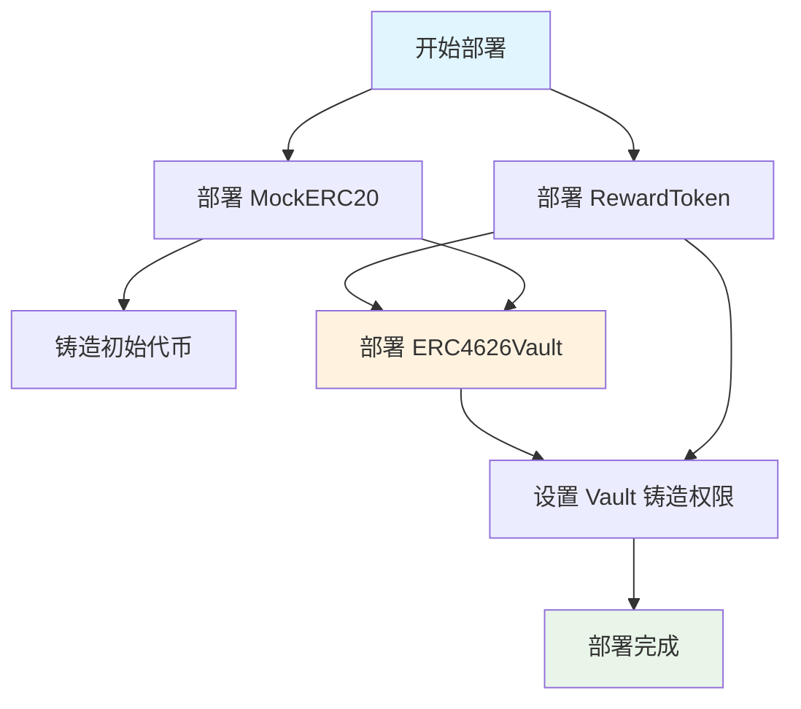

# 04 - Hardhat Ignition 部署与验证

本章介绍使用 Hardhat Ignition 部署 ERC4626 固定利率金库的完整流程。Ignition 是 Hardhat 的现代化声明式部署系统，提供更可靠的部署体验。

## 环境准备

### 1. 配置环境变量
创建 `.env` 文件并配置必要参数：

```bash
# 网络配置
SEPOLIA_RPC_URL=https://sepolia.infura.io/v3/YOUR_PROJECT_ID
PRIVATE_KEY=0x... # 你的钱包私钥（请注意安全）

# 合约验证
ETHERSCAN_API_KEY=YOUR_ETHERSCAN_API_KEY
```

### 2. 安装依赖并编译
```bash
npm install
npx hardhat compile
```

## Ignition 模块架构

### 部署流程图



## 部署命令详解

### 基础部署命令
```bash
# 部署到 Sepolia 测试网
npx hardhat ignition deploy ignition/modules/FixedYieldVaults.ts --network sepolia
```

## 合约验证

### 自动验证（推荐）
部署时直接验证：
```bash
npx hardhat ignition deploy ignition/modules/FixedYieldVaults.ts \
  --network sepolia \
  --verify
```

### 手动验证
如果部署时未验证，可以后续验证：
```bash
# 验证指定链上的所有合约
npx hardhat ignition verify chain-11155111 --include-unrelated-contracts

# 或者验证特定模块
npx hardhat ignition verify FixedYieldVaultsModule --network sepolia
```

## 部署后配置

### 1. 保存合约地址
部署完成后，合约地址会保存在：
```bash
# 主要地址文件
ignition/deployments/chain-11155111/deployed_addresses.json

# 示例内容：
{
  "FixedYieldVaultsModule#MockERC20": "0x87CD692f80994C8b23D600d697AF5460035AfaC6",
  "FixedYieldVaultsModule#RewardToken": "0x708370bFf84Fee18a285B7Eb3CdfBc42B151eb03", 
  "FixedYieldVaultsModule#FixedRateERC4626Vault": "0x84538aAB4b9514241cAA4e7a4f601F066E93bF9c"
}
```

### 2. 更新前端配置
将部署地址更新到前端环境变量：

```bash
# frontend/.env.local
NEXT_PUBLIC_VAULT_ADDRESS=0x84538aAB4b9514241cAA4e7a4f601F066E93bF9c
NEXT_PUBLIC_UNDERLYING_ADDRESS=0x87CD692f80994C8b23D600d697AF5460035AfaC6
NEXT_PUBLIC_REWARD_TOKEN_ADDRESS=0x708370bFf84Fee18a285B7Eb3CdfBc42B151eb03
```

下一章我们将学习如何将前端连接到已部署的合约。