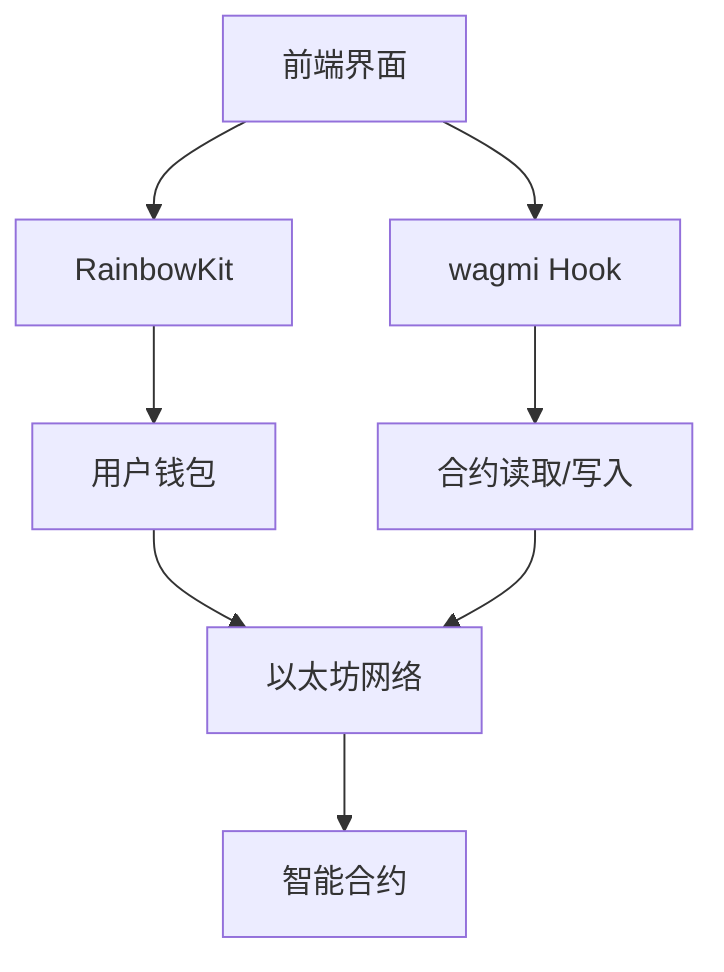
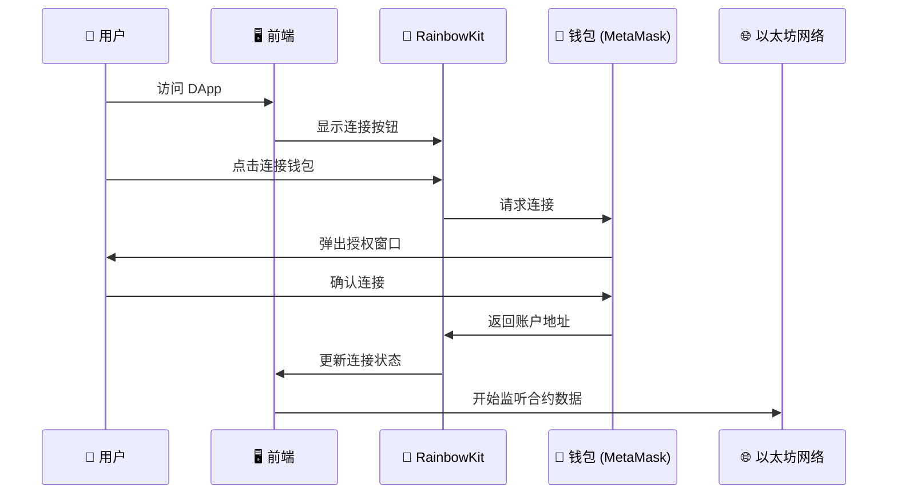
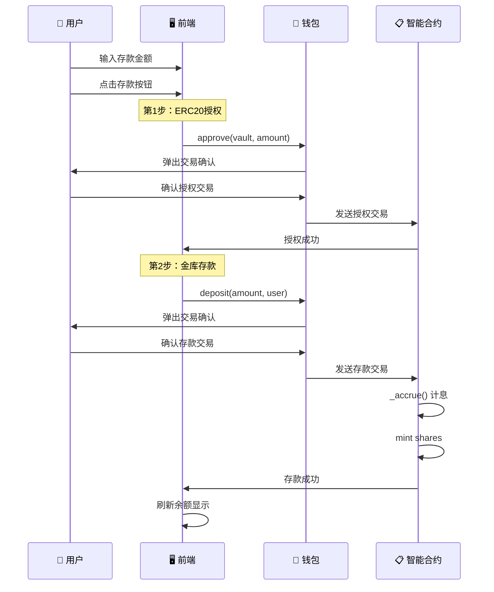
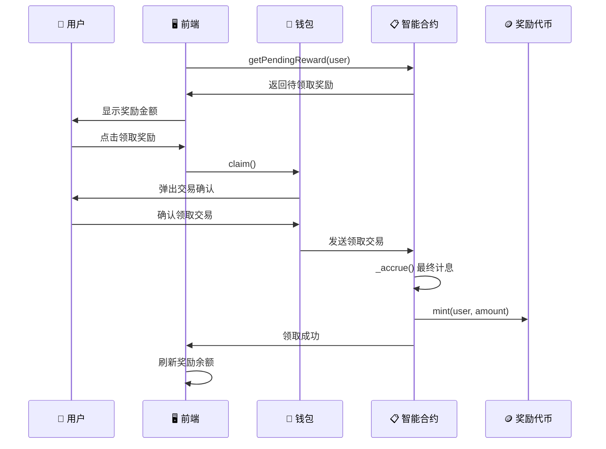

# 05 - 前端集成

本章将实现一个完整的 DApp 前端，重点学习前端→钱包→合约的交互流程。

## 技术栈
- **Next.js 14** + TypeScript
- **wagmi**: 以太坊 React Hooks 库  
- **RainbowKit**: 钱包连接组件

## DApp 交互架构

### Web3 连接层次



### 基础配置

**核心 Provider 设置**：
```typescript
// 支持 Sepolia 测试网络
const config = getDefaultConfig({
  appName: "Fixed Yield DeFi",
  chains: [sepolia],
  ssr: false, // 禁用服务端渲染
});
```

## 合约交互核心

### useVault Hook

**数据读取** - 监听合约状态：
```typescript
const { data: shares } = useReadContract({
  address: VAULT_ADDRESS,
  abi: VAULT_ABI,
  functionName: "balanceOf", 
  args: [userAddress],
});
```

**交易执行** - 写入合约：
```typescript
const { writeContract } = useWriteContract();

const deposit = async (amount: string) => {
  // 1. 先授权 ERC20
  await writeContract({
    address: UNDERLYING_ADDRESS,
    abi: ERC20_ABI,
    functionName: "approve",
    args: [VAULT_ADDRESS, parseEther(amount)],
  });
  
  // 2. 调用存款
  await writeContract({
    address: VAULT_ADDRESS,
    abi: VAULT_ABI,
    functionName: "deposit",
    args: [parseEther(amount), userAddress],
  });
};
```

## 主要界面组件

### 钱包连接
```typescript
import { ConnectButton } from '@rainbow-me/rainbowkit';

// 一键连接多种钱包
<ConnectButton />
```

### 数据展示
```typescript
// 实时读取合约数据
const { data: shares } = useReadContract({
  functionName: "balanceOf",
  args: [userAddress],
});

const { data: pendingReward } = useReadContract({
  functionName: "getPendingReward", 
  args: [userAddress],
});
```

## 前端→钱包→合约交互流程

### 1. 钱包连接流程



### 2. 存款交易流程



### 3. 奖励领取流程



### 4. 关键交互要点

**双重确认机制**：
- 每个交易都需要用户在钱包中确认
- 前端显示交易状态（等待确认/处理中/完成）

**实时数据同步**：
```typescript
// wagmi 自动监听链上数据变化
const { data: balance } = useReadContract({
  watch: true, // 实时监听
  functionName: "balanceOf",
});
```

## 启动方式

```bash
cd frontend
npm install
npm run dev
# 访问 http://localhost:3000
```

这样，用户就可以通过简洁的界面与我们的 ERC4626 金库合约进行完整交互！