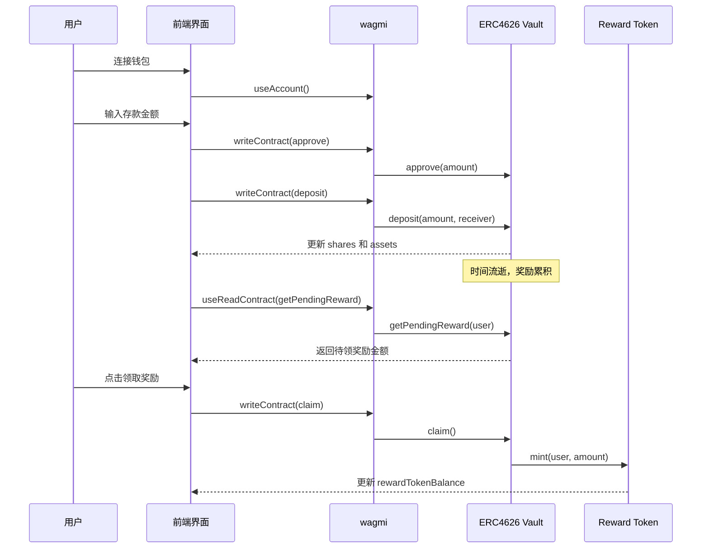

# 05 - 前端集成

本章介绍 ERC4626 固定利率金库的前端实现，基于 Next.js 14 构建的现代化 DApp 界面。

## 技术栈

- **框架**: Next.js 14 (App Router)
- **样式**: TailwindCSS 暗黑主题设计
- **Web3**: wagmi + viem + RainbowKit
- **状态管理**: React Hooks + @tanstack/react-query

## 核心组件架构

### 1. `app/vault/page.tsx` - 主界面
ERC4626 固定利率金库的完整操作界面，包含：

#### 合约信息区域
- **Vault 合约地址**: 可点击跳转 Sepolia Etherscan
- **Underlying Token 地址**: 底层资产代币合约
- **Reward Token 地址**: 奖励代币合约

#### 实时数据展示
- **年化利率**: 以百分比显示（如 5.00%）
- **持有份额**: 用户在金库中的 shares 数量
- **对应资产**: shares 转换后的底层资产价值
- **待领奖励**: 累积但未领取的奖励金额

#### 钱包余额
- **Underlying Token 余额**: 可用于存款的代币数量
- **已领取 Reward Token**: 用户钱包中的奖励代币余额

#### 操作区域
1. **💰 存款 (Deposit)**
   - 输入存款金额
   - 自动处理授权和存款流程
   - 显示授权/存款状态

2. **💸 提款 (Withdraw)**
   - 输入提款金额
   - 直接从金库提取底层资产
   - 实时验证可提款余额

3. **🎁 领取奖励 (Claim)**
   - 显示可领取奖励金额
   - 一键领取到钱包
   - mint 新的 Reward Token

### 2. `hooks/useVault.ts` - 核心 Hook
封装所有金库交互逻辑：

#### 数据读取
```typescript
// 合约地址
vaultAddress, underlyingAddress, rewardTokenAddress

// 用户余额数据
shares                  // 用户持有的金库份额
assets                  // 份额对应的底层资产价值
pendingReward          // 待领取奖励
underlyingBalance      // 钱包中的底层代币余额
rewardTokenBalance     // 钱包中的奖励代币余额
annualRateBps          // 年化利率（基点）
```

#### 交易操作
```typescript
approve(amount)        // 授权底层代币
deposit(amount)        // 存入指定金额
withdraw(amount)       // 提取指定金额
claim()               // 领取所有待领奖励
```

#### 状态管理
```typescript
isApproving           // 授权进行中
isDepositing          // 存款进行中
isWithdrawing         // 提款进行中
isClaiming            // 领取进行中
isConfirming          // 区块确认中
```

## 交互流程



## 用户体验特性

### 响应式设计
- 移动端友好的网格布局
- 自适应卡片和按钮尺寸

### 实时状态反馈
- 交易进行中的加载指示器
- 区块确认状态提示
- 友好的错误处理

### 便民功能
- 合约地址一键跳转区块链浏览器
- 实时余额更新
- 交易状态可视化

### 安全考虑
- 输入验证和边界检查
- 重入保护（合约层面）
- 授权金额精确控制

## 部署配置

前端需要在 `.env.local` 中配置合约地址：

```bash
NEXT_PUBLIC_VAULT_ADDRESS=0x...           # ERC4626 Vault 合约
NEXT_PUBLIC_UNDERLYING_ADDRESS=0x...      # 底层代币合约
NEXT_PUBLIC_REWARD_TOKEN_ADDRESS=0x...    # 奖励代币合约
NEXT_PUBLIC_CHAIN_ID=11155111            # Sepolia 测试网
```

启动开发服务器：
```bash
cd frontend
npm install
npm run dev
```

## 技术亮点

1. **类型安全**: 全 TypeScript 实现，确保类型安全
2. **性能优化**: 使用 React Query 缓存合约数据
3. **用户体验**: 加载状态、错误提示、交易确认
4. **现代化**: Next.js 14 App Router + 最新 Web3 技术栈
5. **可维护性**: 清晰的组件分离和 Hook 抽象
