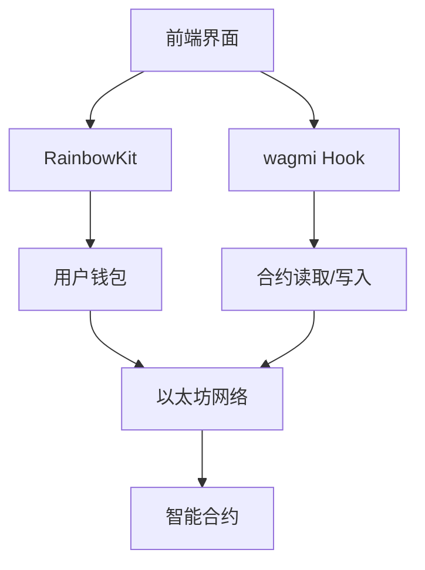
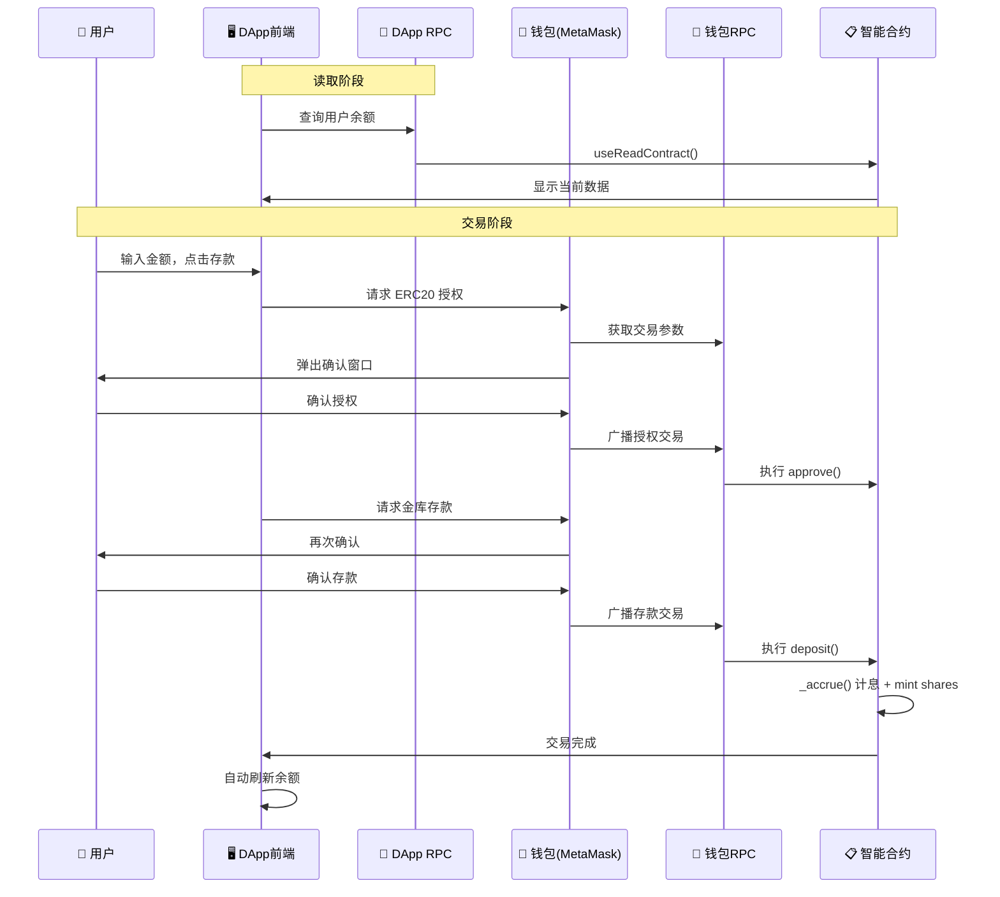

# 05 - 前端集成

本章将实现一个完整的 DApp 前端，重点学习前端→钱包→合约的交互流程。

## 技术栈
- **Next.js 14** + TypeScript
- **wagmi**: 以太坊 React Hooks 库  
- **RainbowKit**: 钱包连接组件

## DApp 交互架构

### Web3 连接层次



### 基础配置

**核心 Provider 设置**：
```typescript
// 支持 Sepolia 测试网络
const config = getDefaultConfig({
  appName: "Fixed Yield DeFi",
  chains: [sepolia],
  transports: {
    [sepolia.id]: http(), // 使用默认公共RPC
  },
  ssr: false, // 禁用服务端渲染
});
```

### RPC 节点配置

**⚠️ 重要概念**：DApp 和用户钱包使用不同的 RPC 节点
- **合约读取**：走 DApp 配置的 RPC（如下面的 `http()`）
- **交易签名/广播**：走钱包的 RPC（用户在 MetaMask 中配置的节点）

**生产环境建议配置专用 RPC**：
```typescript
transports: {
  [sepolia.id]: http('https://sepolia.infura.io/v3/YOUR_PROJECT_ID'),
}
```

## 核心组件实现

### useVault Hook - 合约交互封装

```typescript
export function useVault() {
  const { address } = useAccount();
  const { writeContract } = useWriteContract();

  // 实时读取合约数据
  const { data: shares } = useReadContract({
    address: VAULT_ADDRESS,
    abi: VAULT_ABI,
    functionName: "balanceOf", 
    args: address ? [address] : undefined,
    watch: true, // 实时监听链上变化
  });

  const { data: pendingReward } = useReadContract({
    address: VAULT_ADDRESS,
    abi: VAULT_ABI,
    functionName: "getPendingReward",
    args: address ? [address] : undefined,
    watch: true,
  });

  // 存款操作（两步流程）
  const deposit = async (amount: string) => {
    // 1. ERC20 授权
    await writeContract({
      address: UNDERLYING_ADDRESS,
      abi: ERC20_ABI,
      functionName: "approve",
      args: [VAULT_ADDRESS, parseEther(amount)],
    });
    
    // 2. 金库存款
    await writeContract({
      address: VAULT_ADDRESS,
      abi: VAULT_ABI,
      functionName: "deposit",
      args: [parseEther(amount), address],
    });
  };

  return { shares, pendingReward, deposit, /* ... */ };
}
```

### 界面组件

**钱包连接**：
```typescript
import { ConnectButton } from '@rainbow-me/rainbowkit';
<ConnectButton /> // 一键连接多种钱包
```

**业务操作界面**：
```typescript
function VaultInterface() {
  const { shares, pendingReward, deposit } = useVault();
  
  return (
    <div>
      <p>我的份额: {shares}</p>
      <p>待领取奖励: {pendingReward}</p>
      <button onClick={() => deposit("100")}>存款 100</button>
    </div>
  );
}
```

## 完整业务流程

### 存款交易详细流程



### 关键设计要点

**1. RPC 分工明确**：
- **DApp RPC**：负责读取合约数据（`useReadContract`）
- **钱包 RPC**：负责交易签名和广播（`writeContract`）

**2. 用户体验优化**：
```typescript
// 实时监听链上变化，无需手动刷新
const { data: shares } = useReadContract({
  watch: true, // 关键配置
  functionName: "balanceOf",
});
```

**3. 错误处理**：
```typescript
try {
  await writeContract({ /* ... */ });
} catch (error) {
  if (error.code === 4001) {
    // 用户拒绝交易
  }
}
```

## 启动方式

```bash
cd frontend
npm install
npm run dev
# 访问 http://localhost:3000
```

这样，用户就可以通过简洁的界面与我们的 ERC4626 金库合约进行完整交互！