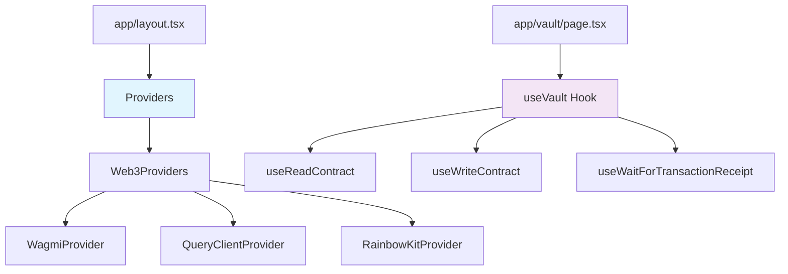
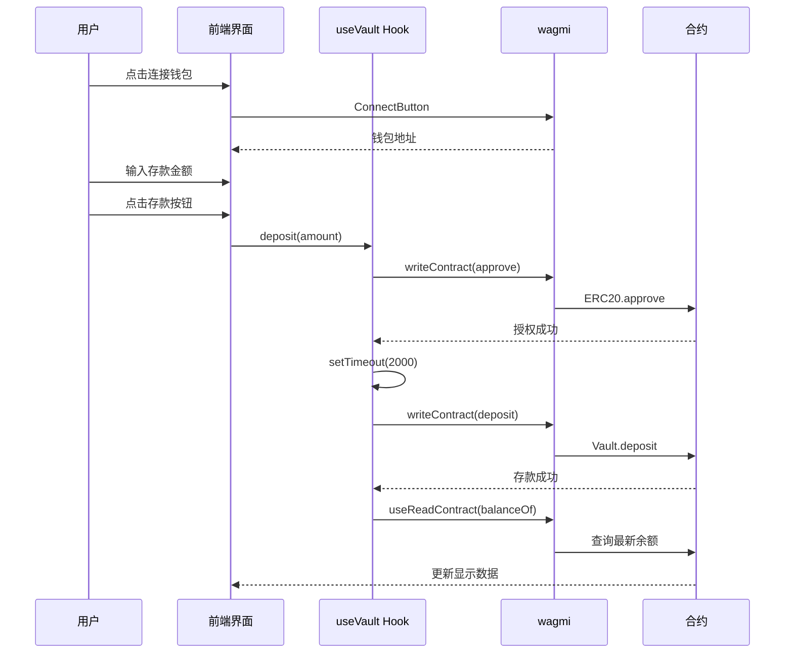

# 05 - 前端集成

基于前面学习的合约知识，本章将实现一个完整的 DApp 前端界面，连接我们的 ERC4626 固定利率金库。

## 技术栈与架构

### 核心技术栈
- **Next.js 14**: App Router + TypeScript
- **wagmi**: 以太坊 React Hooks 库
- **viem**: 轻量级以太坊客户端
- **RainbowKit**: 钱包连接组件
- **TailwindCSS**: 实用优先的 CSS 框架

### 架构设计



## Web3 基础设施

### 1. Provider 层级结构

**app/providers.tsx** - 客户端渲染控制：
```typescript
// 动态导入，完全禁用 SSR
const Web3Providers = dynamic(
  () => import("./web3-providers").then((mod) => ({ default: mod.Web3Providers })),
  {
    ssr: false,
    loading: () => <div>正在初始化钱包连接...</div>
  }
);

export function Providers({ children }: ProvidersProps) {
  const [mounted, setMounted] = useState(false);
  
  useEffect(() => {
    setMounted(true);
  }, []);

  // 确保只在客户端渲染
  if (!mounted) {
    return <div>正在加载应用...</div>;
  }

  return <Web3Providers>{children}</Web3Providers>;
}
```

**app/web3-providers.tsx** - Web3 核心配置：
```typescript
const config = getDefaultConfig({
  appName: "Fixed Yield DeFi",
  projectId: "demo", 
  chains: [sepolia],
  transports: {
    [sepolia.id]: http(),
  },
  ssr: false,
});

export function Web3Providers({ children }: Web3ProvidersProps) {
  return (
    <WagmiProvider config={config}>
      <QueryClientProvider client={queryClient}>
        <RainbowKitProvider>
          {children}
        </RainbowKitProvider>
      </QueryClientProvider>
    </WagmiProvider>
  );
}
```

## 核心 Hook 实现

### useVault Hook 架构

**hooks/useVault.ts** 封装了所有金库交互逻辑：

```typescript
export function useVault() {
  const { address } = useAccount();
  
  // 状态管理
  const [isApproving, setIsApproving] = useState(false);
  const [isDepositing, setIsDepositing] = useState(false);
  const [isWithdrawing, setIsWithdrawing] = useState(false);
  const [isClaiming, setIsClaiming] = useState(false);

  // 合约读取
  const { data: shares } = useReadContract({
    address: VAULT_ADDRESS,
    abi: VAULT_ABI,
    functionName: "balanceOf",
    args: address ? [address] : undefined,
  });

  // 合约写入
  const { writeContract, data: hash } = useWriteContract();
  const { isLoading: isConfirming } = useWaitForTransactionReceipt({ hash });

  // 操作函数
  const deposit = async (amount: string) => {
    if (!address) return;
    setIsDepositing(true);
    try {
      await approve(amount);        // 先授权
      setTimeout(() => {            // 等待授权确认
        writeContract({
          address: VAULT_ADDRESS,
          abi: VAULT_ABI,
          functionName: "deposit",
          args: [parseEther(amount), address],
        });
        setIsDepositing(false);
      }, 2000);
    } catch (error) {
      console.error("Deposit failed:", error);
      setIsDepositing(false);
    }
  };

  return {
    // 数据
    shares: shares ? formatEther(shares) : "0",
    assets, pendingReward, underlyingBalance, rewardTokenBalance,
    // 状态
    isApproving, isDepositing, isWithdrawing, isClaiming, isConfirming,
    // 操作
    approve, deposit, withdraw, claim,
  };
}
```

### ABI 定义策略

精简的 ABI 定义，只包含必要函数：

```typescript
// ERC20 基础 ABI
const ERC20_ABI = [
  {
    inputs: [{ name: "owner", type: "address" }],
    name: "balanceOf",
    outputs: [{ type: "uint256" }],
    stateMutability: "view",
    type: "function",
  },
  {
    inputs: [{ name: "spender", type: "address" }, { name: "amount", type: "uint256" }],
    name: "approve", 
    outputs: [{ type: "bool" }],
    stateMutability: "nonpayable",
    type: "function",
  },
] as const;

// ERC4626 Vault ABI - 包含我们合约的自定义函数
const VAULT_ABI = [
  // 标准 ERC4626 函数
  { name: "deposit", ... },
  { name: "withdraw", ... },
  { name: "balanceOf", ... },
  { name: "convertToAssets", ... },
  
  // 自定义函数
  { name: "claim", ... },
  { name: "getPendingReward", ... },
  { name: "annualRateBps", ... },
] as const;
```

## 主界面实现详解

### 页面结构设计

**app/vault/page.tsx** 采用响应式网格布局：

```typescript
export default function VaultPage() {
  const { address, isConnected } = useAccount();
  const [depositAmount, setDepositAmount] = useState("");
  const [withdrawAmount, setWithdrawAmount] = useState("");

  const {
    vaultAddress, underlyingAddress, rewardTokenAddress,
    shares, assets, pendingReward, underlyingBalance, rewardTokenBalance,
    annualRateBps, isApproving, isDepositing, isWithdrawing, isClaiming,
    isConfirming, approve, deposit, withdraw, claim,
  } = useVault();

  const isLoading = isApproving || isDepositing || isWithdrawing || isClaiming || isConfirming;

  return (
    <div className="space-y-6">
      {/* 头部区域 */}
      <div className="flex items-center justify-between">
        <div>
          <h1 className="text-3xl font-bold">ERC4626 固定利率金库</h1>
          <p className="text-slate-400 mt-1">存入代币获得固定年化收益</p>
        </div>
        <ConnectButton />
      </div>

      {!isConnected ? (
        <div className="text-center py-12">
          <p className="text-xl text-slate-400">请连接钱包开始使用</p>
        </div>
      ) : (
        // 主要内容区域
      )}
    </div>
  );
}
```

### 核心功能区域

#### 1. 合约信息展示
```typescript
{/* 合约信息 - 可点击跳转 Etherscan */}
<div className="grid grid-cols-1 md:grid-cols-3 gap-4">
  <div className="bg-slate-900 p-4 rounded-lg">
    <h3 className="text-sm font-medium text-slate-400 mb-2">Vault 合约</h3>
    <a 
      href={`https://sepolia.etherscan.io/address/${vaultAddress}`}
      target="_blank"
      rel="noopener noreferrer"
      className="font-mono text-xs break-all text-blue-400 hover:text-blue-300 hover:underline transition-colors"
    >
      {vaultAddress}
    </a>
  </div>
  {/* Underlying Token 和 Reward Token 类似 */}
</div>
```

#### 2. 实时数据展示
```typescript
{/* 余额信息 - 4列网格布局 */}
<div className="grid grid-cols-2 md:grid-cols-4 gap-4">
  <div className="bg-slate-900 p-4 rounded-lg text-center">
    <p className="text-sm text-slate-400">年化利率</p>
    <p className="text-2xl font-bold text-emerald-400">
      {(annualRateBps / 100).toFixed(2)}%
    </p>
  </div>
  <div className="bg-slate-900 p-4 rounded-lg text-center">
    <p className="text-sm text-slate-400">我的 Shares</p>
    <p className="text-xl font-semibold">{parseFloat(shares).toFixed(4)}</p>
  </div>
  <div className="bg-slate-900 p-4 rounded-lg text-center">
    <p className="text-sm text-slate-400">对应 Assets</p>
    <p className="text-xl font-semibold">{parseFloat(assets).toFixed(4)}</p>
  </div>
  <div className="bg-slate-900 p-4 rounded-lg text-center">
    <p className="text-sm text-slate-400">待领奖励</p>
    <p className="text-xl font-semibold text-yellow-400">
      {parseFloat(pendingReward).toFixed(4)}
    </p>
  </div>
</div>
```

#### 3. 三大核心操作

**存款操作**：
```typescript
<div className="bg-slate-900 p-6 rounded-lg">
  <h3 className="text-lg font-semibold mb-4 text-emerald-400">💰 存款</h3>
  <div className="space-y-4">
    <div>
      <label className="block text-sm text-slate-400 mb-2">存款金额</label>
      <input
        type="number"
        step="1"
        value={depositAmount}
        onChange={(e) => setDepositAmount(e.target.value)}
        placeholder="输入存款金额"
        className="w-full px-3 py-2 bg-slate-800 border border-slate-600 rounded-md"
        disabled={isLoading}
      />
    </div>
    <button
      onClick={() => depositAmount && deposit(depositAmount)}
      disabled={isLoading || !depositAmount}
      className="w-full py-2 px-4 bg-emerald-600 hover:bg-emerald-700 disabled:opacity-50 disabled:cursor-not-allowed rounded-md font-medium"
    >
      {isDepositing ? "存款中..." : isApproving ? "授权中..." : "存款"}
    </button>
  </div>
</div>
```

**提款操作**：
```typescript
<button
  onClick={() => withdrawAmount && withdraw(withdrawAmount)}
  disabled={isLoading || !withdrawAmount || parseFloat(assets) === 0}
  className="w-full py-2 px-4 bg-blue-600 hover:bg-blue-700 disabled:opacity-50 disabled:cursor-not-allowed rounded-md font-medium"
>
  {isWithdrawing ? "提款中..." : "提款"}
</button>
```

**奖励领取**：
```typescript
<button
  onClick={claim}
  disabled={isLoading || parseFloat(pendingReward) === 0}
  className="w-full py-2 px-4 bg-yellow-600 hover:bg-yellow-700 disabled:opacity-50 disabled:cursor-not-allowed rounded-md font-medium"
>
  {isClaiming ? "领取中..." : "领取奖励"}
</button>
```

## 状态管理与用户体验

### 交易状态跟踪

```typescript
// 全局加载状态
const isLoading = isApproving || isDepositing || isWithdrawing || isClaiming || isConfirming;

// 状态指示器
{isLoading && (
  <div className="bg-blue-900/50 border border-blue-500 p-4 rounded-lg">
    <p className="text-blue-200">
      ⏳ 交易处理中，请稍候...
      {isConfirming && " (等待区块确认)"}
    </p>
  </div>
)}
```

### 数据格式化与显示

```typescript
// 使用 viem 的 formatEther 和 parseEther
return {
  shares: shares ? formatEther(shares) : "0",
  assets: assets ? formatEther(assets) : "0", 
  pendingReward: pendingReward ? formatEther(pendingReward) : "0",
  underlyingBalance: underlyingBalance ? formatEther(underlyingBalance) : "0",
  rewardTokenBalance: rewardTokenBalance ? formatEther(rewardTokenBalance) : "0",
  annualRateBps: annualRateBps ? Number(annualRateBps) : 0,
};

// 前端显示时保留4位小数
{parseFloat(shares).toFixed(4)}
```

## 完整交互流程



## 环境配置

### 环境变量设置
```bash
# frontend/.env.local
NEXT_PUBLIC_VAULT_ADDRESS=0x...           # ERC4626 Vault 合约
NEXT_PUBLIC_UNDERLYING_ADDRESS=0x...      # 底层代币合约  
NEXT_PUBLIC_REWARD_TOKEN_ADDRESS=0x...    # 奖励代币合约
NEXT_PUBLIC_CHAIN_ID=11155111            # Sepolia 测试网
```

### 启动开发服务器
```bash
cd frontend
npm install
npm run dev
# http://localhost:3000
```

## 技术亮点总结

1. **SSR 兼容**: 完善的客户端渲染处理，避免水合错误
2. **类型安全**: 全 TypeScript + wagmi 类型推导
3. **状态管理**: 细粒度的加载状态和错误处理
4. **用户体验**: 实时数据更新 + 直观的交易状态反馈
5. **响应式设计**: 移动端友好的网格布局
6. **链上集成**: 直接连接真实的智能合约

下一章我们将学习如何部署合约并配置前端连接。