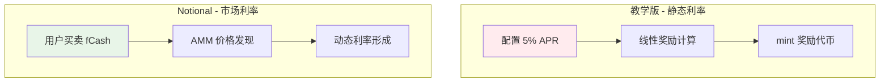
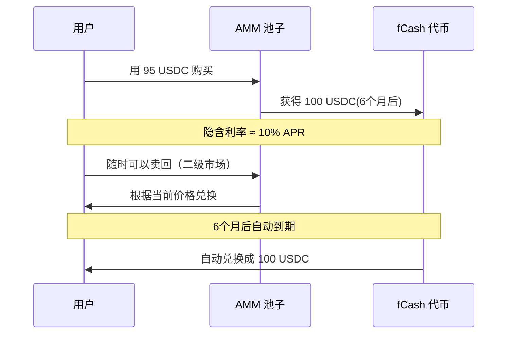

# 06 - 从教学版到真实世界：Notional 对比分析

在前面的课程中，我们实现了一个简化的固定利率金库。现在让我们看看真实的 DeFi 固定利率协议是如何设计的，以 Notional Finance 为例。

## 核心概念对比

### 我们的教学版 Vault
- **固定利率**：5% APR，写在代码里
- **奖励机制**：线性计算，`时间 × 本金 × 利率`
- **代币形式**：ERC4626 Shares + 奖励代币

### Notional Finance
- **固定利率**：通过市场交易形成
- **核心产品**：fCash（未来现金流代币）
- **交易机制**：AMM 自动做市商

## 关键差异分析

### 1. 利率形成机制



**教学版**：利率是固定的，由合约部署时设定
**Notional**：利率由市场供需决定，实时变化

### 2. 产品设计思路

| 特性 | 教学版 Vault | Notional Finance |
|------|-------------|------------------|
| **本质** | 存款获得奖励 | 交易未来现金流 |
| **固定利率实现** | 时间线性计算 | 买入并持有到期 |
| **流动性** | 随时存取 | AMM 提供二级市场 |
| **风险管理** | 无风险（教学用） | 清算、保证金机制 |

### 3. 技术实现差异

**我们的 Vault**：
```solidity
// 简单的线性奖励
function _accrue(address user) internal {
    uint256 elapsed = block.timestamp - lastAccrueTimestampByUser[user];
    uint256 rewardRate = (assets * annualRateBps) / 10_000;
    uint256 linear = (rewardRate * elapsed) / ONE_YEAR;
    rewardAccruedByUser[user] += linear;
}
```

**Notional 的 fCash**：
```solidity
// 伪代码：通过价格差实现固定利率
function buyFixedRate() external {
    // 购买 fCash（如 100 USDC 的 6 个月后价值）
    // 如果花费 95 USDC 买到，隐含年化利率约 10%
    uint256 fCashAmount = calculatefCash(currentPrice, maturity);
    // 到期时自动兑换成 100 USDC
}
```

## 为什么需要 fCash？

### 传统固定利率的问题
1. **利率来源**：谁来支付固定利率？
2. **流动性**：资金锁定期间如何提前退出？
3. **风险管理**：如何处理违约风险？

### fCash 的解决方案


## 实际应用场景对比

### 教学版适用场景
- ✅ **学习 DeFi 基础概念**
- ✅ **理解 ERC4626 标准**
- ✅ **体验合约交互**
- ❌ 真实资金管理

### Notional 适用场景  
- ✅ **机构资金管理**
- ✅ **套期保值**
- ✅ **收益率策略**
- ✅ **大额固定利率需求**

## 从教学到生产的升级路径

如果要将我们的教学版升级到生产级别，需要考虑：

### 1. 利率机制升级
```solidity
// 当前：固定利率
uint256 public constant annualRateBps = 500;

// 升级：市场化利率
function getCurrentRate() public view returns (uint256) {
    return oracleContract.getMarketRate();
}
```

### 2. 风险管理
- **清算机制**：抵押不足时的处理
- **价格预言机**：获取准确的资产价格
- **紧急暂停**：异常情况下的保护机制

### 3. 流动性优化
- **二级市场**：允许用户交易份额
- **流动性挖矿**：激励提供流动性
- **自动复投**：奖励自动重新投资

## 总结

| 维度 | 教学版 | 生产级 (Notional) |
|------|--------|-------------------|
| **复杂度** | 简单易懂 | 复杂但强大 |
| **适用性** | 教学演示 | 真实应用 |
| **利率** | 固定静态 | 市场动态 |
| **风险** | 无风险 | 完整风险管理 |

我们的教学版虽然简化，但涵盖了固定利率 DeFi 的核心概念：
- **时间价值**：未来的钱比现在的钱便宜
- **利率计算**：如何量化时间成本
- **代币化**：将收益权转化为可交易资产

这为理解更复杂的 DeFi 协议打下了坚实基础！