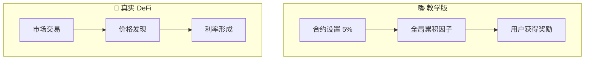
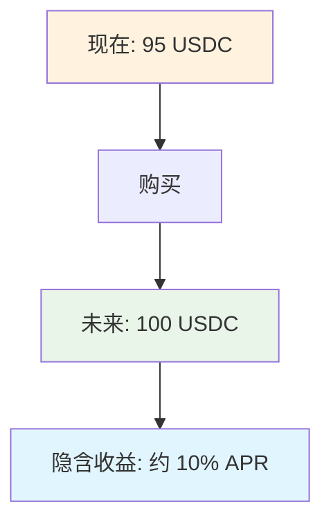

# 06 - 进阶理解：教学版 vs 真实 DeFi

完成了我们的固定利率金库后，让我们对比一下真实世界的 DeFi 固定利率协议，理解两者的差异和各自的适用场景。

## 两种固定利率方案

### 📚 教学版：简单直接
- **利率设定**：5% APR，合约参数
- **工作原理**：全局累积因子，精确计息
- **用户体验**：存款→等待→领取奖励

### 🏦 真实 DeFi：市场驱动  
- **利率来源**：供需关系决定
- **核心机制**：交易未来收益权
- **产品形态**：可交易的固定收益代币

## 核心差异

### 利率来源不同



**教学版**：利率写死在代码里，简单可靠
**真实版**：利率由市场决定，实时变化

### 工作方式对比

| 特点 | 📚 教学版 | 🏦 真实 DeFi |
|------|----------|-------------|
| **操作** | 存款获得奖励 | 交易未来收益 |
| **利率** | 固定 5% | 市场决定 |
| **流动性** | 随时存取 | 可二级交易 |
| **复杂度** | 简单易懂 | 功能复杂 |

### 技术实现对比

**我们的方案**：
```solidity
// 全局累积因子机制
function _accrue(address user) internal {
    _updateGlobalAccumulator();  // 更新全局累积因子
    uint256 unpaidRewards = globalAccumulated - userPaid[user];
    rewardAccruedByUser[user] += (assets * unpaidRewards) / 1e18;
}
```

**真实 DeFi 的思路**：
```solidity
// 通过价格差实现固定收益
// 花 95 USDC 买 100 USDC(6个月后) → 隐含 10% 年化
// 到期自动兑换，或提前在市场卖出
```

## 真实 DeFi 解决了什么问题？

### 我们教学版的局限
1. **利率来源**：5% 的奖励从哪里来？
2. **可持续性**：长期如何维持？
3. **市场化**：利率能否反映真实供需？

### 真实 DeFi 的解决思路



**核心思想**：不是"给利息"，而是"买未来的钱"
- 花 95 块买 6 个月后的 100 块
- 差价就是你的固定收益
- 市场决定这个价格合理性

## 适用场景

### 📚 教学版：理解概念
- ✅ 学习 DeFi 基础
- ✅ 体验合约交互  
- ✅ 理解 ERC4626 标准
- ✅ 掌握利息计算

### 🏦 真实 DeFi：实际应用
- ✅ 机构资金管理
- ✅ 收益率交易
- ✅ 风险对冲
- ✅ 大额资金需求

## 学到了什么？

我们的教学版虽然简化，但教会了固定收益的**核心思想**：

### 🎯 关键概念
1. **时间价值**：未来的钱值多少？
2. **利率计算**：如何量化时间成本？
3. **代币化收益**：将收益权变成可交易资产

### 🛠️ 技术能力
1. **ERC4626 标准**：金库合约的标准接口
2. **精确计息**：全局累积因子避免重复计算
3. **合约交互**：前端如何与智能合约通信

### 🌱 为进阶打基础
- 理解了基础，就能看懂复杂的 DeFi 协议
- 掌握了原理，就能设计自己的金融产品
- 学会了工具，就能构建真实的 DApp

恭喜你完成了从 0 到 1 的 DeFi 开发之旅！🎉