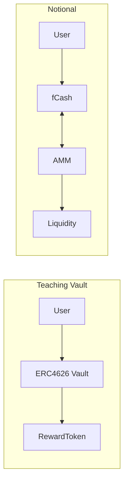

# 06 - Notional Deep Dive（教学版对比）

下表对比教学版 Vault 与 Notional（简化）：

| 维度 | 教学版固定利率 Vault | Notional Finance |
|---|---|---|
| 利率来源 | 固定 APR，配置项 | 市场机制（fCash/AMM） |
| 头寸形态 | Shares/Assets + 线性奖励 | fCash 债券类头寸 |
| 清算/风险 | 无清算、仅教学 | 有清算、保证金、折扣 |
| 流动性 | 简化 | AMM 提供流动性 |

